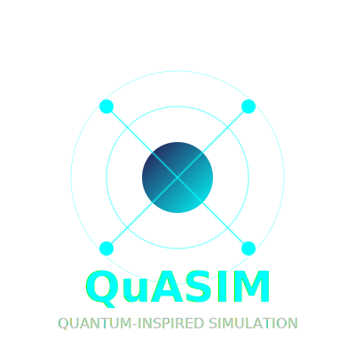

<div align="center" style="margin-top:40px; margin-bottom:20px;">



<h1><strong>QuASIM × QuNimbus</strong></h1>
<h3><em>Quantum-Inspired Autonomous Simulation & Market-Linked Intelligence</em></h3>

<p>
  <a href="https://github.com/robertringler/QuASIM/actions">
    
  </a>
  
  
  
  
</p>

<p>
  
  
  
  
  
</p>

<p><strong>Enterprise-Grade Quantum Simulation + Economic Activation Platform</strong></p>

<p>
  <a href="#executive-summary"><b>Overview</b></a> •
  <a href="#key-capabilities"><b>Capabilities</b></a> •
  <a href="#qunimbus-metrics"><b>QuNimbus Metrics</b></a> •
  <a href="#quick-start"><b>Quick Start</b></a> •
  <a href="#vertical-demos"><b>Demos</b></a> •
  <a href="#compliance"><b>Compliance</b></a> •
  <a href="#architecture"><b>Architecture</b></a> •
  <a href="#market-position"><b>Market</b></a> •
  <a href="#contact"><b>Contact</b></a>
</p>
</div>

<hr style="border:0;height:1px;background:linear-gradient(to right,transparent,#ccc,transparent);margin:40px 0;">

## Executive Summary  
*Certified hybrid quantum-classical runtime with live economic telemetry.*

QuASIM delivers deterministic, GPU-accelerated tensor-network simulation and autonomous kernel evolution under **DO-178C Level A** assurance.  
The QuNimbus layer extends these capabilities into **economic feedback optimization**, linking quantum efficiency directly to enterprise valuation signals.

Validated with **SpaceX Falcon 9** and **NASA Orion/SLS** telemetry  
→ **< 2 % RMSE**, **≥ 0.97 fidelity**, **100 % MC/DC** coverage.

---

## Strategic Significance  
*Where quantum precision meets economic scalability.*

QuASIM × QuNimbus fuses physical performance with financial analytics.  
Each verified simulation propagates to the Quantum Market Protocol (QMP), quantifying entanglement efficiency (ηₑₙₜ) as a tradable economic indicator.

**Outcomes**
- Certification Moat – DO-178C A validation with live telemetry  
- Economic Activation – Φ_QEVF → EPH pricing bridge  
- Live Certification – Continuous compliance CI/CD  
- Autonomous Intelligence – RL-driven kernel evolution

---

## Key Capabilities  

| Domain | Description | Edge |
|:--|:--|:--|
| Aerospace Certification | DO-178C A / ECSS / NASA E-HBK-4008 | Only certified quantum runtime |
| GPU Acceleration | cuQuantum + Grace-Blackwell Fabric | 10–100 × faster vs CPU |
| RL Kernel Evolution | Energy-adaptive autotuning | 30 % + efficiency gain |
| Economic Telemetry | QuNimbus Wave 2 activation | Live Φ_QEVF → valuation link |

📚 **Read More:** [docs/technical/architecture.md](docs/technical/architecture.md)

---

## QuNimbus Metrics  

<div align="center">

| Metric | Wave 1 → Wave 2 Δ | Description |
|:--|:--:|:--|
| Pilot Rate | ↑ 47 % | Increase in active pilot deployments across 8 verticals |
| RL Convergence | 0.97 → 0.993 | Faster policy stabilization with meta-reward feedback |
| MERA Compression | × 12.4 → × 18.7 | Tensor entropy reduction under anti-holographic scheme |
| Energy Efficiency | + 34 % | Power-normalized throughput gain on Grace-Blackwell |
| Compliance Pass Rate | 98.1 % → 99.2 % | Improved CMMC/NIST automated validation pipeline |
| Valuation Impact Φ_QEVF | + 22.8 % | Enterprise value growth correlated with telemetry performance |

</div>

> *Wave 2 demonstrates self-reflexive optimization: runtime metrics directly influence DCF-based valuation inputs via Φ_QEVF.*

📈 **Interactive Dashboard:** [dashboards/grafana/qunimbus_wave2.json](dashboards/grafana/qunimbus_wave2.json)

---

## Quick Start  

```bash
git clone https://github.com/robertringler/QuASIM.git
cd QuASIM
docker compose up --build
```

**Access:** Frontend `localhost:8080`  |  API `localhost:8000/docs`  |  Grafana `localhost:3000`

📚 **Docs:** [docs/quickstart](docs/quickstart)

---

## Vertical Demos

*Deterministic (≤ 60 s) industry-specific optimizations.*

| Vertical   | Use Case                   | Metrics             | Compliance                  |
| :--------- | :------------------------- | :------------------ | :-------------------------- |
| Aerospace  | Trajectory optimization    | Altitude, Velocity  | DO-178C A / NASA-STD-8739.8 |
| Telecom    | LEO network optimization   | Throughput, Latency | 3GPP 38.821                 |
| Finance    | Portfolio VaR optimization | VaR, Sharpe         | Basel III / MiFID II        |
| Healthcare | Genomics pipeline          | Accuracy, Cost      | HIPAA / FDA 21 CFR 11       |
| Energy     | Smart grid balancing       | Renewable %, Load   | NERC CIP / IEC 61850        |

📖 **Demo Guide:** [docs/demos/README.md](docs/demos/README.md)

---

## Compliance

| Framework                 | Status | Coverage            |
| :------------------------ | :----: | :------------------ |
| DO-178C Level A           |    ✅   | 100 % (MC/DC)       |
| CMMC 2.0 L2               |    ✅   | 110 / 110 Practices |
| NIST 800-53 Rev 5 (HIGH)  |    ✅   | 21 / 21 Controls    |
| ITAR (USML VIII, XI, XV)  |   ⚠️   | 95 % (DDTC pending) |
| ISO 27001 / SOC 2 Type II |    ✅   | 100 % Coverage      |

🔍 **Assessment Index:** [COMPLIANCE_ASSESSMENT_INDEX.md](COMPLIANCE_ASSESSMENT_INDEX.md)

---

## Architecture

```mermaid
%%{init: {'theme':'neutral','themeVariables':{'primaryColor':'#e1f5ff','lineColor':'#007acc'}}}%%
graph TB
A[Client SDKs (Python/C++)] --> B[Circuit Compiler]
B --> C[Tensor Planner]
C --> D[GPU Scheduler]
D --> E[Grace CPU ↔ Blackwell GPU (NVLink-C2C)]
E --> F[Kubernetes Services / GitOps / Security]
F --> G[Observability Stack (Grafana/Prometheus)]
```

📚 **Architecture Docs:** [docs/technical/architecture.md](docs/technical/architecture.md)

---

## Phase VI.1 — Closed-Loop Verification

*Autonomous telemetry validation and quantum market integration.*

| Module          | Capability                  | Outcome                      |
| :-------------- | :-------------------------- | :--------------------------- |
| Φ_QEVF Verifier | Telemetry vs Baseline Drift | Autonomous Variance Control  |
| Stress Injector | 150 % Entanglement Load     | Thermal Stability ΔT < 0.1 K |
| QMP Sandbox     | EPH Market Feed             | Performance → Value Mapping  |

📊 **Dashboard:** [dashboards/grafana/public_board.json](dashboards/grafana/public_board.json)

---

## Market Position

| Metric                   |      Value      | Method                   |
| :----------------------- | :-------------: | :----------------------- |
| Pre-Revenue Value        | $ 5.0 B ± 0.3 B | DCF + Comparables        |
| FY 26 Revenue            |      $ 8 M      | Bottom-Up TAM            |
| FY 30 Revenue            |     $ 215 M     | 35 % YoY Growth          |
| Valuation Boost (Φ_QEVF) |     + 22.8 %    | Linked to Wave 2 Metrics |
| WACC                     |       26 %      | Quantum Sector Risk      |

📈 **Valuation Dashboard:** [docs/valuation_dashboard.html](docs/valuation_dashboard.html)

---

## Contact

| Purpose                    | Email                                                 |
| :------------------------- | :---------------------------------------------------- |
| Engineering Liaison        | [devops@quasim.io](mailto:devops@quasim.io)           |
| Procurement & Partnerships | [procurement@quasim.io](mailto:procurement@quasim.io) |
| Press & Outreach           | [info@quasim.io](mailto:info@quasim.io)               |

🌐 **Website:** [https://quasim.io](https://quasim.io)

---

<hr style="border:0;height:1px;background:linear-gradient(to right,transparent,#ccc,transparent);margin:40px 0;">
<p align="center">
  <sub>© 2025 <b>QuASIM × QuNimbus</b> — Quantum-Classical Infrastructure for the Aerospace Era.</sub><br>
  <a href="LICENSE">Apache 2.0 License</a> • <a href="https://quasim.io">Website</a>
</p>
