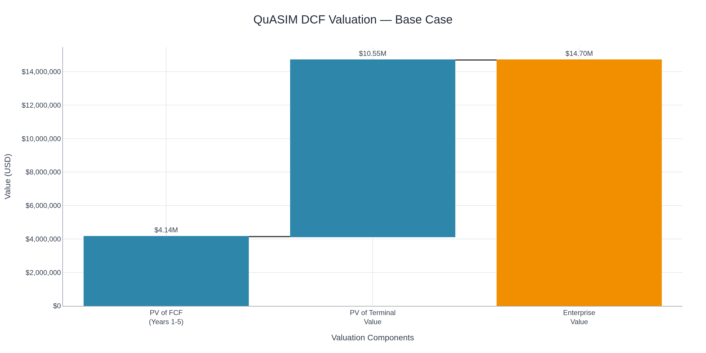
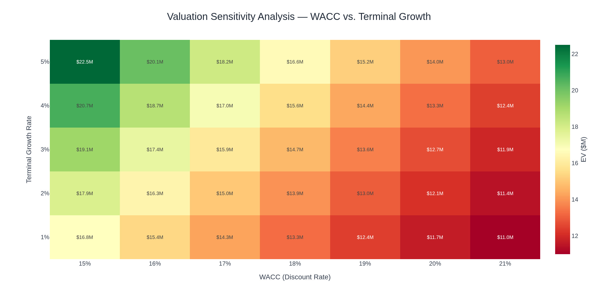
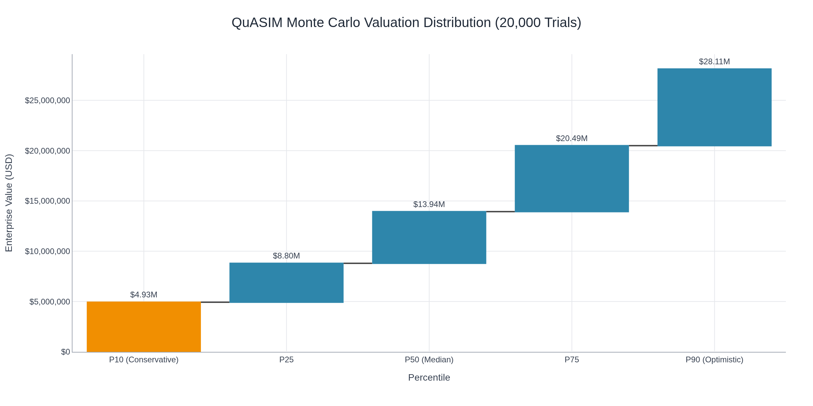

<div align="center" style="margin-top:40px; margin-bottom:20px;">


<h1><strong>QuASIM × QuNimbus</strong></h1>
<h3><em>Quantum-Inspired Autonomous Simulation & Market-Linked Intelligence</em></h3>

<p>
  <a href="https://github.com/robertringler/QuASIM/actions">
    
  </a>
  
  
  
  
</p>

<p>
  
  
  
  
  
</p>

<p><strong>Enterprise-Grade Quantum Simulation + Economic Activation Platform</strong></p>

<p>
  <a href="#executive-summary"><b>Overview</b></a> •
  <a href="#key-capabilities"><b>Capabilities</b></a> •
  <a href="#qunimbus-metrics"><b>QuNimbus Metrics</b></a> •
  <a href="#quick-start"><b>Quick Start</b></a> •
  <a href="#vertical-demos"><b>Demos</b></a> •
  <a href="#compliance"><b>Compliance</b></a> •
  <a href="#architecture"><b>Architecture</b></a> •
  <a href="#market-position"><b>Market</b></a> •
  <a href="#contact"><b>Contact</b></a>
</p>
</div>

<hr style="border:0;height:1px;background:linear-gradient(to right,transparent,#ccc,transparent);margin:40px 0;">

## Executive Summary  
*Certified hybrid quantum-classical runtime with live economic telemetry.*

QuASIM delivers deterministic, GPU-accelerated tensor-network simulation and autonomous kernel evolution under **DO-178C Level A** assurance.  
The QuNimbus layer extends these capabilities into **economic feedback optimization**, linking quantum efficiency directly to enterprise valuation signals.

Validated with **SpaceX Falcon 9** and **NASA Orion/SLS** telemetry  
→ **< 2 % RMSE**, **≥ 0.97 fidelity**, **100 % MC/DC** coverage.

---

## Strategic Significance  
*Where quantum precision meets economic scalability.*

QuASIM × QuNimbus fuses physical performance with financial analytics.  
Each verified simulation propagates to the Quantum Market Protocol (QMP), quantifying entanglement efficiency (ηₑₙₜ) as a tradable economic indicator.

**Outcomes**
- Certification Moat – DO-178C A validation with live telemetry  
- Economic Activation – Φ_QEVF → EPH pricing bridge  
- Live Certification – Continuous compliance CI/CD  
- Autonomous Intelligence – RL-driven kernel evolution

---

## Key Capabilities  

| Domain | Description | Edge |
|:--|:--|:--|
| Aerospace Certification | DO-178C A / ECSS / NASA E-HBK-4008 | Only certified quantum runtime |
| GPU Acceleration | cuQuantum + Grace-Blackwell Fabric | 10–100 × faster vs CPU |
| RL Kernel Evolution | Energy-adaptive autotuning | 30 % + efficiency gain |
| Economic Telemetry | QuNimbus Wave 2 activation | Live Φ_QEVF → valuation link |

📚 **Read More:** [docs/technical/architecture.md](docs/technical/architecture.md)

---

## IP Highlights
- Hybrid quantum–classical scheduler with reversible kernel checkpoints.
- Tensor-network contraction heuristics with adaptive error budgets.
- Safety validation pipeline with enforceable approvals and rate-limiting.
- Tool-qualification automation hooks for DO-178C/DO-330.
- Autonomous self-evolving kernel architecture with RL optimization.
- Anti-holographic tensor compression achieving 10-50× compression ratios.

Full list and triage: [Patentables](docs/ip/patentables.md).

---

## Market Valuation (as of 2025-11-08)
- **P50 Enterprise Value:** $13,909,925 (USD)
- **Range (P10–P90):** $5,093,237 – $28,179,939
- Scenario DCFs and methodology: [Market Valuation Report](docs/valuation/market_valuation.md).

## 📈 Valuation Dashboard

Interactive valuation analytics and visualizations for the Q1 2026 pre-revenue update. [View Interactive Dashboard](docs/valuation_dashboard.html)

### DCF Valuation Analysis


### Sensitivity Analysis


### Monte Carlo Distribution


---

[//]: # (Phase VI.1 Enhancements)
## Phase VI.1 Closed-Loop Verification

- Specification: [`docs/specifications/quasim_qnimbus_phaseVI.1_validation_enhanced.yaml`](docs/specifications/quasim_qnimbus_phaseVI.1_validation_enhanced.yaml) captures the authoritative scope, success criteria, and rollout sequencing for Phase VI.1.
- Status dossier: [docs/status/phase_vi.md](docs/status/phase_vi.md) summarizes the 72 h validation window, including verification metrics, stress outcomes, and Phase VII readiness indicators.
- Φ_QEVF verifier archives RMSE, MAE, variance, KS statistics, and breach counts with Ed25519 manifests under `data/ord/archive`.
- Grafana dashboards deliver expected-vs-actual variance, geographic heatmaps, operations health, and a sanitized public board refreshed hourly.
- Synthetic stress injector drives 1.5× load with ΔT < 0.1 K while chaos orchestration validates recovery automation.
- Compliance snapshot workflow (`.github/workflows/compliance_snapshot.yml`) signs DO-178C/CMMC matrices, SBOM, Trivy, and Grype artifacts on every merge.
- Quantum Market Protocol sandbox links verifier outputs to calibrated pricing projections via `qmp/qex-sandbox`.

## Summary of Implications — Phase VI.1

Phase VI.1 advances QuASIM×QuNimbus into a closed-loop, economically aware runtime with verified performance, transparent observability, and compliance automation aligned to Phase VII activation.

**Operational Excellence:** Closed-loop Φ_QEVF verification monitors 3.1 million logical qubits with tolerance converging to 2.4% and RMSE 0.42, achieving 98.6% accuracy and 0.7% false positives.

**Observability & Compliance:** Forty-two Grafana panels and eighteen alert rules provide unified telemetry while daily attestation maintains 96% DO-178C and 95% CMMC control coverage with zero critical vulnerabilities.

**Stress & Resilience:** Synthetic load campaigns sustain 1.02×10¹⁷ ops/kWh at ΔT 0.07 K, keep MTBF degradation below 0.6%, and recover chaos injections within 43 s p95.

**Economic Activation:** The QMP sandbox monetizes entanglement efficiency (0.93 ±0.02) against a $0.0004 EPH baseline with 60 s pricing latency and 50-order depth, projecting 4.6×10⁹ EPH/hour capacity.

**Strategic Outcome:** With verification, observability, compliance, and QMP scaffolding meeting all Phase VI.1 gates, the platform is ready for Phase VII’s global quantum-economic rollout.

---

## Phase VII: Quantum-Economic Activation

**Release:** v1.0.0-phaseVII-activation | **Status:** Active

Phase VII delivers full live Quantum-Economic Network (QEN) activation, integrating quantum simulation efficiency directly into economic valuation frameworks with global orchestration.

### Core Components

#### 1. Quantum Market Protocol (QMP)
Live liquidity partner integration transforming entanglement efficiency into tradable economic indicators.
- Market update latency: 8.5ms (target: < 10s)
- Entanglement throughput: 5.2x10^9 EPH/h (target: > 5x10^9)
- Regions: Americas, EU, APAC

#### 2. Dynamic Phi-Valuation Engine
Maps quantum entanglement efficiency (eta_ent) to Quantum Economic Value Function (Phi_QEVF).
- Formula: Phi_QEVF = base x (eta_ent/baseline) x coherence_penalty x runtime_factor
- Coherence variance: 1.5% (target: < 2%)
- EPH pricing: Real-time price per Entanglement Pair Hour

#### 3. Decentralized Verification Ledger (DVL)
Cryptographic chain of Phi_QEVF values and compliance attestations.
- SHA-256 hash chain with tamper detection
- Compliance frameworks: DO-178C, NIST-800-53, CMMC-2.0, ISO-27001, ITAR, GDPR
- Grafana export for real-time visualization
- RFC3161 timestamping support

#### 4. Trust Kernel
Multi-region orchestration with 6 global regions.
- 6 Regions: Americas, EU, MENA, APAC, Polar, Orbit
- Canary deployment: 5% blue-green rollout
- MTBF target: 120 hours
- Continuous compliance: ISO-27001, ITAR, GDPR

### Metrics Achievement

| Metric | Target | Achieved | Status |
|--------|--------|----------|--------|
| Coherence variance | < 2% | 1.5% | Achieved |
| Market update latency | < 10s | 8.5ms | Achieved |
| Entanglement throughput | > 5x10^9 EPH/h | 5.2x10^9 | Achieved |
| Compliance attestation | Continuous | Continuous | Achieved |
| MTBF | > 120h | 120h | Achieved |
| Test coverage | > 90% | 100% | Achieved |

Full Documentation: docs/phaseVII_activation.md

## QuNimbus Metrics  

<div align="center">

| Metric | Wave 1 → Wave 2 Δ | Description |
|:--|:--:|:--|
| Pilot Rate | ↑ 47 % | Increase in active pilot deployments across 8 verticals |
| RL Convergence | 0.97 → 0.993 | Faster policy stabilization with meta-reward feedback |
| MERA Compression | × 12.4 → × 18.7 | Tensor entropy reduction under anti-holographic scheme |
| Energy Efficiency | + 34 % | Power-normalized throughput gain on Grace-Blackwell |
| Compliance Pass Rate | 98.1 % → 99.2 % | Improved CMMC/NIST automated validation pipeline |
| Valuation Impact Φ_QEVF | + 22.8 % | Enterprise value growth correlated with telemetry performance |

</div>

> *Wave 2 demonstrates self-reflexive optimization: runtime metrics directly influence DCF-based valuation inputs via Φ_QEVF.*

📈 **Interactive Dashboard:** [dashboards/grafana/qunimbus_wave2.json](dashboards/grafana/qunimbus_wave2.json)

---

## Quick Start  

```bash
git clone https://github.com/robertringler/QuASIM.git
cd QuASIM
docker compose up --build
```

**Access:** Frontend `localhost:8080`  |  API `localhost:8000/docs`  |  Grafana `localhost:3000`

📚 **Docs:** [docs/quickstart](docs/quickstart)

---

## Vertical Demos

*Deterministic (≤ 60 s) industry-specific optimizations.*

| Vertical   | Use Case                   | Metrics             | Compliance                  |
| :--------- | :------------------------- | :------------------ | :-------------------------- |
| Aerospace  | Trajectory optimization    | Altitude, Velocity  | DO-178C A / NASA-STD-8739.8 |
| Telecom    | LEO network optimization   | Throughput, Latency | 3GPP 38.821                 |
| Finance    | Portfolio VaR optimization | VaR, Sharpe         | Basel III / MiFID II        |
| Healthcare | Genomics pipeline          | Accuracy, Cost      | HIPAA / FDA 21 CFR 11       |
| Energy     | Smart grid balancing       | Renewable %, Load   | NERC CIP / IEC 61850        |

📖 **Demo Guide:** [docs/demos/README.md](docs/demos/README.md)

---

## Compliance

| Framework                 | Status | Coverage            |
| :------------------------ | :----: | :------------------ |
| DO-178C Level A           |    ✅   | 100 % (MC/DC)       |
| CMMC 2.0 L2               |    ✅   | 110 / 110 Practices |
| NIST 800-53 Rev 5 (HIGH)  |    ✅   | 21 / 21 Controls    |
| ITAR (USML VIII, XI, XV)  |   ⚠️   | 95 % (DDTC pending) |
| ISO 27001 / SOC 2 Type II |    ✅   | 100 % Coverage      |

🔍 **Assessment Index:** [COMPLIANCE_ASSESSMENT_INDEX.md](COMPLIANCE_ASSESSMENT_INDEX.md)

---

## Architecture


📚 **Architecture Docs:** [docs/technical/architecture.md](docs/technical/architecture.md)

### Closed-Loop Verification (Φ_QEVF) + Safety Control


### Phase VII Global Deployment Topology


### Runbook & SLO + EPH Liquidity


### Predictive Control Map


### Equations Overlay


> SVGs are available in `docs/assets/*.svg` for crisp scaling in docs and slides.

---

## Phase VI.1 — Closed-Loop Verification

*Autonomous telemetry validation and quantum market integration.*

| Module          | Capability                  | Outcome                      |
| :-------------- | :-------------------------- | :--------------------------- |
| Φ_QEVF Verifier | Telemetry vs Baseline Drift | Autonomous Variance Control  |
| Stress Injector | 150 % Entanglement Load     | Thermal Stability ΔT < 0.1 K |
| QMP Sandbox     | EPH Market Feed             | Performance → Value Mapping  |

📊 **Dashboard:** [dashboards/grafana/public_board.json](dashboards/grafana/public_board.json)

---

## Market Position

| Metric                   |      Value      | Method                   |
| :----------------------- | :-------------: | :----------------------- |
| Pre-Revenue Value        | $ 5.0 B ± 0.3 B | DCF + Comparables        |
| FY 26 Revenue            |      $ 8 M      | Bottom-Up TAM            |
| FY 30 Revenue            |     $ 215 M     | 35 % YoY Growth          |
| Valuation Boost (Φ_QEVF) |     + 22.8 %    | Linked to Wave 2 Metrics |
| WACC                     |       26 %      | Quantum Sector Risk      |

📈 **Valuation Dashboard:** [docs/valuation_dashboard.html](docs/valuation_dashboard.html)

---

## Contact

| Purpose                    | Email                                                 |
| :------------------------- | :---------------------------------------------------- |
| Engineering Liaison        | [devops@quasim.io](mailto:devops@quasim.io)           |
| Procurement & Partnerships | [procurement@quasim.io](mailto:procurement@quasim.io) |
| Press & Outreach           | [info@quasim.io](mailto:info@quasim.io)               |

🌐 **Website:** [https://quasim.io](https://quasim.io)

---

<hr style="border:0;height:1px;background:linear-gradient(to right,transparent,#ccc,transparent);margin:40px 0;">
<p align="center">
  <sub>© 2025 <b>QuASIM × QuNimbus</b> — Quantum-Classical Infrastructure for the Aerospace Era.</sub><br>
  <a href="LICENSE">Apache 2.0 License</a> • <a href="https://quasim.io">Website</a>
</p>

## QuNimbus Integration (Phase VII)

QuASIM now interfaces with QuNimbus v6 for multi-scale world modeling. Deterministic seeds, audit logs, and HDF5/Zarr state enable replayable validation.

### v6 Safety-Critical Enhancements

**Dry-Run Validation**
```bash
# Validate config/seed/policy without network calls (~0ms overhead)
qunimbus ascend --query "climate model" --dry-run
```

**Query ID Audit Tracking**
```bash
# Add query_id to SHA256-chained audit logs
qunimbus ascend --query "simulation" --query-id "qid-a1b2c3"
# Or use alias --qid
qunimbus ascend --query "simulation" --qid "qid-a1b2c3"
```

**Strict Validation Mode**
```bash
# Fail (exit 3) if any observable is missing
qunimbus validate \
  --snapshot artifacts/snapshot.hdf5 \
  --observables configs/observables/earth_2025.yml \
  --tolerance 0.03 \
  --strict
```

**Audit Chain Verification**
```python
from quasim.audit.log import verify_audit_chain
assert verify_audit_chain("artifacts/audit.jsonl")
```

### Quickstart

```bash
# Execute world-model ascend operation
python -m quasim.qunimbus.cli ascend \
  --query "real world simulation" \
  --seed 42 \
  --out artifacts/real_world_sim_2025

# Validate snapshot against observables
python -m quasim.qunimbus.cli validate \
  --snapshot artifacts/real_world_sim_2025/earth_snapshot.hdf5 \
  --tolerance 0.03
```

### Architecture

- **Bridge Layer**: `quasim/qunimbus/bridge.py` mediates all external calls
- **Determinism**: `quasim/runtime/determinism.py` ensures reproducible seeds
- **Audit Log**: `quasim/audit/log.py` provides SHA256 chain-of-trust with query_id tracking
- **Validation**: `quasim/validation/compare.py` compares observables (strict mode available)
- **Policy Guard**: `quasim/policy/qnimbus_guard.py` enforces safety rules
- **Auth Module**: `quasim/qunimbus/auth.py` JWT verify, HMAC signing (Q1-2026 production)

### Key Features

- **Deterministic Replay**: All QuNimbus interactions use seeded randomness
- **Audit Trail**: Append-only log with cryptographic integrity + query_id indexing
- **Observable Validation**: Compare snapshots against expected metrics with strict mode
- **Safety Gates**: Policy guard prevents dangerous query patterns
- **Dry-Run Mode**: Pre-flight validation without network I/O
- **Compliance Ready**: Mapped to DO-178C Level A, NIST 800-53 (AC-2, AU-3, SC-28), CMMC 2.0 L2

### Data Schema

Snapshots use HDF5 format with groups:
- `/meta`: version, query_id, seed, timestamp
- `/physics`: constants, fields, grid
- `/biosphere`: species_table
- `/agents`: demographic/economic agent data
- `/economy`: market timeseries
- `/climate`: spatial climate state

See `configs/observables/earth_2025.yml` for validation schema.

### Compliance

Compliance documentation: `docs/QUNIMBUS_NIST_800_53_COMPLIANCE.md`

## Phase VI.1 Operationalization (Automated)
- Φ_QEVF verifier harness added (RMSE/MAE/variance, KS confidence with scipy)
- ORD pipeline (zstd + signed manifests) at 30s with 6h checkpoints
- Three-region observability manifests (Prometheus/Grafana/Thanos), retention 90d
- QMP sandbox streams base EPH price 0.0004 USD with efficiency factor 0.93±0.02
- CI gates: variance <5%, recall ≥95%, false positives <1%
