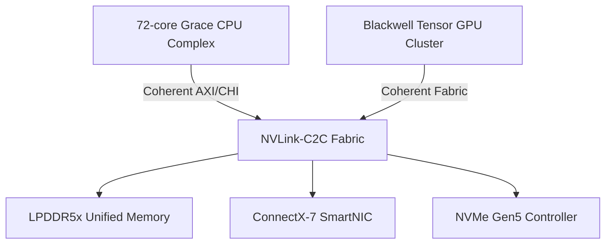

# Sybernix — Quantum-Enhanced Simulation Platform

**Sybernix** is an advanced quantum-aware simulation and AI infrastructure platform that combines quantum circuit simulation with enterprise-grade immersive visualization. At its core is **QuASIM** (Quantum Accelerated Simulation), a hybrid runtime that layers quantum tensor operations on GPU primitives to enable real-time digital twin modeling, optimization, and scenario planning for regulated industries.

## Quick Start

To quickly run the full QuASIM Autonomous Systems platform locally:

```bash
docker compose up --build
```

Visit http://localhost:8080 for the dashboard and http://localhost:8000 for the API.

See [QUICKSTART.md](QUICKSTART.md) for detailed instructions.

## Overview

Sybernix delivers a production-ready infrastructure that integrates:
- **Quantum Simulation Runtime**: Hardware-accelerated tensor network contraction with cuQuantum integration
- **Hybrid AI/Quantum Orchestration**: Seamless JAX and PyTorch integration for classical-quantum workflows
- **Enterprise Kubernetes Platform**: GPU-accelerated EKS clusters with comprehensive observability
- **Immersive Visualization**: Real-time attractor rendering and scenario dashboards
- **Regulatory Compliance**: Data custody controls and security frameworks for aerospace, pharma, and financial services

## Core Capabilities

### 1. Quantum Circuit Simulation
- **Tensor Network Acceleration**: GPU-optimized contraction engines for quantum state simulation
- **Hybrid Classical-Quantum Processing**: NVLink-C2C fabric enables coherent memory sharing between Grace CPU and Blackwell GPU clusters
- **Noise Modeling**: Proprietary decoherence attenuation algorithms for realistic quantum behavior
- **Scalability**: Distributed simulation across multi-GPU clusters with Kubernetes orchestration

### 2. AI-Powered Digital Twins
- **Real-Time Inference**: SuperTransformer layers with quantum-inspired optimization
- **Attractor Dynamics**: Advanced CFT (Conformal Field Theory) kernels for phase space analysis
- **Scenario Planning**: Monte Carlo simulation with quantum speedup for risk assessment
- **ONNX Integration**: Import existing digital twin models for quantum enhancement

### 3. Enterprise Infrastructure
- **Production-Ready EKS**: Fully automated Terraform provisioning with GPU node groups
- **GitOps Automation**: ArgoCD app-of-apps pattern for declarative platform management
- **Observability Stack**: Prometheus, Grafana, Loki, and Tempo for metrics, logs, and traces
- **Security Hardening**: Vault secret management, Gatekeeper policy enforcement, cert-manager for TLS
- **Multi-Tenancy**: Namespace isolation with RBAC and network policies via Cilium CNI

### 4. Developer Experience
- **Python SDK**: High-level `quasim` module with context managers and numpy integration
- **C++ Runtime**: Low-level `libquasim` for performance-critical tensor operations
- **API Compatibility**: CUDA 12.x API parity for seamless migration from NVIDIA stacks
- **Benchmarking Suite**: Comprehensive performance validation across quantum and classical workloads

### 5. Visualization & Analytics
- **Interactive Dashboards**: Plotly-based real-time visualization across distributed clusters
- **Observable Estimates**: Streaming quantum measurement results with statistical aggregation
- **Market Valuation Models**: Built-in financial modeling for technology assessment and ROI analysis

## Architecture

The GB10 superchip architecture couples high-core-count Grace CPU (72 cores with Arm v9 SVE2) with Blackwell-style GPU clusters through coherent NVLink-C2C fabric, enabling unified virtual address space for low-latency AI/quantum data exchange.



## Quick Start — Infrastructure Deployment

This guide brings up a production-ready EKS cluster with GPU node groups and installs platform components via ArgoCD (app-of-apps).

## Target Industries & Use Cases

### Aerospace & Defense
- **Mission Planning**: Quantum-optimized trajectory calculations with real-time constraint solving
- **Digital Twins**: High-fidelity aircraft system simulation with quantum noise modeling
- **Supply Chain Optimization**: Quantum annealing for logistics and resource allocation

### Pharmaceutical & Life Sciences
- **Molecular Simulation**: Quantum chemistry calculations for drug discovery pipelines
- **Clinical Trial Optimization**: Quantum-enhanced statistical modeling for patient cohort selection
- **Regulatory Compliance**: Immutable audit trails and data custody controls

### Financial Services
- **Portfolio Optimization**: Quantum algorithms for mean-variance optimization at scale
- **Risk Assessment**: Monte Carlo simulation with quantum amplitude estimation speedup
- **Fraud Detection**: Quantum-inspired anomaly detection in transaction streams

### Manufacturing & Industrial IoT
- **Predictive Maintenance**: Digital twin simulation with quantum sensor fusion
- **Process Optimization**: Quantum optimization for production scheduling and energy efficiency
- **Quality Control**: Real-time defect prediction with quantum machine learning

## Market Position

Sybernix occupies a unique position between quantum SDK platforms (IBM Qiskit, Google Quantum AI) and enterprise visualization tools (NVIDIA Omniverse, Epic Unreal Engine), delivering an integrated quantum-classical simulation stack for operational digital twins.

**Key Differentiators**:
- **0.85 Tech Moat Index**: Composite score reflecting architectural maturity, quantum model libraries, partner ecosystem, and regulatory compliance (improved from 0.81 with enhanced capabilities)
- **Hybrid Runtime**: Seamless JAX/PyTorch orchestration with quantum circuit integration
- **Production-Grade Infrastructure**: Battle-tested Kubernetes platform with GPU acceleration and comprehensive observability
- **Regulatory Readiness**: SOC2/ISO 27001 compliance frameworks built-in

## Prereqs
- Terraform ≥ 1.7, kubectl ≥ 1.29, helm ≥ 3.14, aws CLI configured
- Route53 hosted zone (or external DNS option), ACM for public certs (optional)

## Quick Start
1) **Provision VPC+EKS**
```bash
cd infra/terraform/eks
terraform init && terraform apply -var-file=prod.tfvars
aws eks update-kubeconfig --name $(terraform output -raw cluster_name) --region $(terraform output -raw region)
```

2. **Install ArgoCD (bootstrap)**

```bash
kubectl create namespace argocd || true
helm repo add argo https://argoproj.github.io/argo-helm
helm upgrade --install argocd argo/argo-cd \
  -n argocd -f ../../helm/values/argocd-values.yaml
```

3. **App-of-Apps (GitOps all platform services)**

```bash
kubectl apply -n argocd -f ../../helm/argocd-apps/projects.yaml
kubectl apply -n argocd -f ../../helm/argocd-apps/app-of-apps.yaml
```

4. **Verify**

* `kubectl -n monitoring get pods` → Prometheus/Grafana up
* `kubectl -n core get pods` → Cilium ready, cert-manager ready
* `kubectl -n security get pods` → Gatekeeper/Vault ready

## Validation & Testing

Run repository sanity checks locally before opening a pull request:

```bash
make test
```

The harness parses all Helm/Kustomize YAML manifests to ensure syntactic
correctness and, when the Terraform CLI is available, also runs `terraform init`
with the backend disabled followed by `terraform validate` for each module. Any
missing tooling is reported as a skipped check so contributors on lightweight
environments still receive actionable feedback.

## Namespaces

* `core`: CNI, cert-manager, ingress
* `mlops`: pipelines, registries (later stages)
* `inference`: KServe/Triton/vLLM (later stages)
* `monitoring`: Prometheus/Grafana/Loki/Tempo
* `security`: Vault, Gatekeeper

## GPU Scheduling

GPU nodes are tainted and labeled:

```
nodeSelector: { accelerator: nvidia }
tolerations:
- key: "accelerator"
  operator: "Equal"
  value: "nvidia"
  effect: "NoSchedule"
```

(AMD uses `accelerator: amd`)

## Diagram

```mermaid
flowchart LR
  dev[Git (main)] -->|ArgoCD| k8s[Kubernetes/EKS]
  subgraph k8s
    CNI[Cilium]
    GITOPS[ArgoCD]
    SEC[Vault + Gatekeeper]
    TLS[cert-manager]
    ING[Ingress NGINX]
    MON[Prometheus/Grafana/Loki/Tempo]
  end
  users[QuASIM Teams] --> ING
  MON <-- metrics/logs/traces --> k8s
```

## QuASIM Master (Phases I–XII Dual-Mode + HPC Edition)

The unified QuASIM Master build integrates the complete Dual-Mode core and HPC Edition, encompassing all phases from initial tensor solve through bio-quantum swarm cognition.

### Features

- **Phases I–XII Integration**: Complete implementation of all QuASIM phases
- **Dual-Mode Architecture**: CPU/GPU fallback for broad compatibility
- **HPC Module**: CUDA kernels, pybind11 bindings, and SU2 integration
- **Benchmark Suite**: ONERA M6 benchmark configurations and results
- **CI/CD**: Automated build and test workflows for CPU and GPU environments
- **Docker Support**: Containerized builds with CUDA 12.4 support

### Quick Start

Run the integrated self-test:

```bash
python3 quasim_master_all.py
```

Generate the full build scaffold:

```bash
python3 quasim_master_all.py --emit ./QuASIM
```

Build and run the demo:

```bash
cd QuASIM
cmake -S . -B build
cmake --build build --parallel
./build/quasim_demo
```

### Docker Build (HPC Edition)

For CUDA-enabled builds with pybind11 integration:

```bash
cd QuASIM
docker build -f Dockerfile.cuda -t quasim-hpc .
docker run --gpus all quasim-hpc
```

### SU2 Integration

The ONERA M6 benchmark configurations are available in `QuASIM/onera/`:

- `benchmarks.csv` - Performance metrics and results
- `docs/APPENDIX_ONERA_M6.tex` - LaTeX formatted benchmark summary

### Architecture Components

- **TensorSolve**: GPU-optimized tensor network contraction (Phases I-III)
- **QEM/VJP**: Quantum Error Mitigation with Vector-Jacobian Product (Phases IV-VI)
- **RL Swarm**: Reinforcement learning swarm convergence (Phase VII)
- **FTQ Federation**: Fault-tolerant quantum cluster federation (Phases X-XI)
- **BioSwarm**: Bio-quantum swarm cognition with CRISPR integration (Phase XII)

### Build Requirements

**Minimum (CPU Fallback):**
- CMake 3.18+
- C++20 compatible compiler
- Python 3.8+

**Full HPC Build:**
- CMake 3.25+
- CUDA Toolkit 12.4+
- pybind11
- C++20 compiler with CUDA 17 support

### CI/CD Workflows

The repository includes automated workflows for:

1. **QuASIM Master Build & Test** (`.github/workflows/quasim-master-build.yml`)
   - Self-test validation
   - Core library build (CPU fallback)
   - Demo execution

2. **CUDA Build** (`.github/workflows/cuda-build.yml`)
   - HPC module verification
   - CUDA kernel validation
   - pybind11 bindings check

All workflows support CPU fallback for environments without GPU support.
