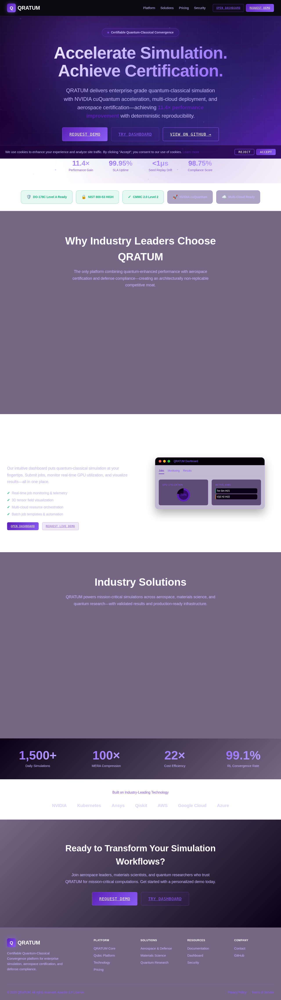
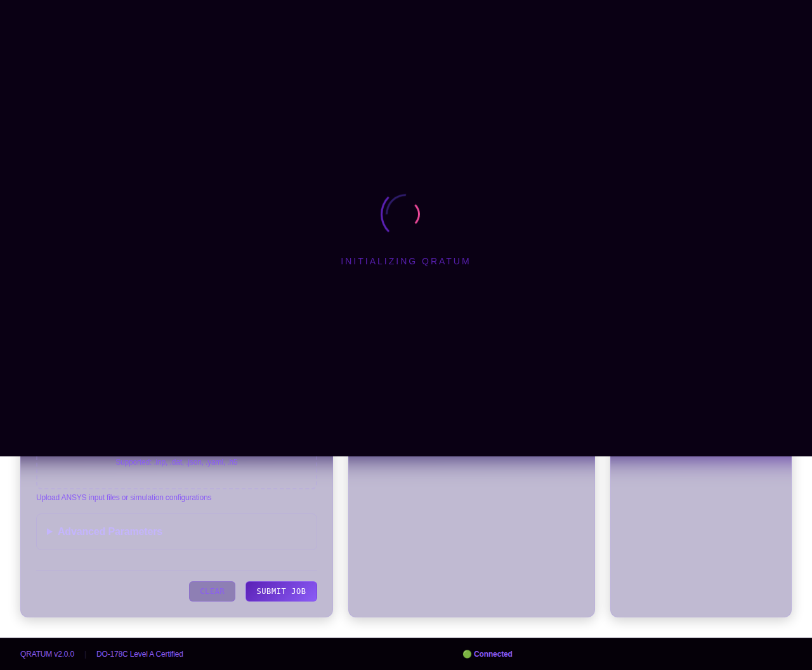

# QRATUM Enterprise Design System

## Overview

The QRATUM design system implements a professional, enterprise-grade visual identity for quantum-classical workflows. The design features a cohesive purple gradient color scheme with glass-morphism effects, smooth animations, and a modern, accessible interface.

## Design Philosophy

- **Professional & Enterprise-Grade**: Visual parity with industry leaders
- **Quantum-Themed**: Purple gradients representing quantum states and superposition
- **Glass-Morphism**: Modern blur effects with transparency for depth
- **Performance-First**: 60 FPS animations with GPU acceleration
- **Accessible**: WCAG 2.1 AA compliant with 4.5:1 contrast ratios

## Color Palette

### Purple Gradient Core

```css
--primary-dark: #1a0033;      /* Deep purple - darkest */
--primary: #5b21b6;            /* Royal purple - main brand */
--primary-light: #8b5cf6;      /* Light purple - accents */
--primary-lighter: #a78bfa;    /* Lighter purple - highlights */
```

### Secondary Colors

```css
--secondary: #2d1b69;          /* Mid-tone purple */
--secondary-dark: #1a0033;     /* Deep purple (same as primary-dark) */
--secondary-light: #5b21b6;    /* Royal purple (same as primary) */
```

### Accent Colors

```css
--accent-cyan: #00f5ff;        /* Cyan - quantum visualization */
--accent: #ec4899;             /* Pink - CTAs and highlights */
--accent-emerald: #10b981;     /* Green - success states */
```

### Status Colors

```css
--success: #10b981;            /* Success/complete states */
--warning: #f59e0b;            /* Warning/pending states */
--error: #ef4444;              /* Error/failed states */
--info: #00f5ff;               /* Info/running states */
```

### Backgrounds

```css
--bg-dark: #0a0014;                          /* Base background */
--bg-darker: #050008;                        /* Darker background */
--bg-panel: rgba(26, 0, 51, 0.6);           /* Glass panel */
--bg-card: rgba(45, 27, 105, 0.3);          /* Card background */
--bg-hover: rgba(91, 33, 182, 0.15);        /* Hover state */
--bg-primary: linear-gradient(135deg, #1a0033 0%, #2d1b69 50%, #5b21b6 100%);
--bg-glass: rgba(91, 33, 182, 0.15);        /* Glass effect */
```

### Text Colors

```css
--text-primary: #ffffff;       /* Primary text - white */
--text-secondary: #c4b5fd;     /* Secondary text - light purple */
--text-muted: #8b5cf6;         /* Muted text - medium purple */
```

### Border Colors

```css
--border-glow: rgba(139, 92, 246, 0.4);      /* Glowing borders */
--border-subtle: rgba(167, 139, 250, 0.2);   /* Subtle borders */
--border-strong: rgba(139, 92, 246, 0.6);    /* Strong borders */
```

## Typography

### Font Families

```css
--font-display: 'Inter', 'Roboto', sans-serif;   /* Headings */
--font-body: 'Inter', 'Roboto', sans-serif;      /* Body text */
--font-mono: 'Roboto Mono', 'SF Mono', monospace; /* Code/metrics */
```

### Font Weights

- **400**: Regular body text
- **500**: Medium emphasis
- **600**: Semi-bold headings
- **700**: Bold headings
- **800**: Extra bold hero text

### Letter Spacing

```css
--letter-spacing-tight: -0.01em;   /* Headings */
--letter-spacing-normal: 0;        /* Body text */
--letter-spacing-wide: 0.05em;     /* Labels/buttons */
```

## Spacing System

Based on 4px/8px grid for consistency:

```css
--spacing-xs: 4px;
--spacing-sm: 8px;
--spacing-md: 16px;
--spacing-lg: 24px;
--spacing-xl: 32px;
--spacing-2xl: 48px;
```

## Border Radius

Modern, rounded corners:

```css
--radius-sm: 6px;      /* Small elements */
--radius-md: 8px;      /* Default */
--radius-lg: 12px;     /* Cards */
--radius-xl: 16px;     /* Large cards */
--radius-full: 9999px; /* Pills/circles */
```

## Animations & Transitions

### Timing Functions

```css
--transition-smooth: cubic-bezier(0.4, 0, 0.2, 1);
--transition-fast: 150ms cubic-bezier(0.4, 0, 0.2, 1);
--transition-normal: 300ms cubic-bezier(0.4, 0, 0.2, 1);
--transition-slow: 600ms cubic-bezier(0.4, 0, 0.2, 1);
```

### Common Animations

#### Shimmer Effect (Progress Bars)

```css
@keyframes shimmer {
    0% { left: -100%; }
    100% { left: 100%; }
}
```

#### Pulse (Badges, Indicators)

```css
@keyframes badgePulse {
    0%, 100% { 
        opacity: 1;
        box-shadow: 0 0 10px #8b5cf6;
    }
    50% { 
        opacity: 0.6;
        box-shadow: 0 0 20px #8b5cf6;
    }
}
```

#### Fade In

```css
@keyframes fadeIn {
    from { opacity: 0; transform: translateY(10px); }
    to { opacity: 1; transform: translateY(0); }
}
```

## Glass-Morphism Effects

### Standard Glass Panel

```css
.glass-panel {
    background: rgba(45, 27, 105, 0.3);
    backdrop-filter: blur(20px);
    -webkit-backdrop-filter: blur(20px);
    border: 1px solid rgba(139, 92, 246, 0.3);
    box-shadow: 0 4px 20px rgba(0, 0, 0, 0.2);
}
```

### Navigation Bar

```css
.nav-glass {
    background: rgba(26, 0, 51, 0.7);
    backdrop-filter: blur(20px);
    -webkit-backdrop-filter: blur(20px);
    box-shadow: 0 4px 30px rgba(0, 0, 0, 0.1);
}
```

## Component Styles

### Buttons

#### Primary Button

```css
.btn-primary {
    background: linear-gradient(135deg, #5b21b6 0%, #8b5cf6 100%);
    color: #ffffff;
    border: 1px solid rgba(139, 92, 246, 0.5);
    position: relative;
    overflow: hidden;
}

.btn-primary:hover {
    background: linear-gradient(135deg, #6d28d9 0%, #a78bfa 100%);
    box-shadow: 0 8px 32px rgba(91, 33, 182, 0.4);
    transform: translateY(-1px);
}
```

#### Secondary Button

```css
.btn-secondary {
    background: rgba(91, 33, 182, 0.1);
    color: #8b5cf6;
    border: 1px solid rgba(139, 92, 246, 0.4);
    backdrop-filter: blur(10px);
}
```

### Cards

```css
.card {
    background: rgba(45, 27, 105, 0.3);
    border: 1px solid rgba(167, 139, 250, 0.2);
    border-radius: 12px;
    backdrop-filter: blur(20px);
    box-shadow: 0 4px 20px rgba(0, 0, 0, 0.2);
    transition: all 300ms cubic-bezier(0.4, 0, 0.2, 1);
}

.card:hover {
    border-color: rgba(139, 92, 246, 0.6);
    transform: translateY(-2px);
    box-shadow: 0 8px 40px rgba(91, 33, 182, 0.3);
}
```

### Form Inputs

```css
input, select, textarea {
    background: rgba(26, 0, 51, 0.5);
    border: 1px solid rgba(167, 139, 250, 0.2);
    color: #ffffff;
    backdrop-filter: blur(10px);
}

input:focus {
    border-color: #8b5cf6;
    box-shadow: 0 0 0 3px rgba(139, 92, 246, 0.2),
                0 4px 20px rgba(91, 33, 182, 0.3);
    background: rgba(45, 27, 105, 0.5);
}
```

### Gauges & Metrics

```css
.gauge {
    background: conic-gradient(
        #8b5cf6 0deg,
        #a78bfa calc(var(--value, 0) * 3.6deg),
        rgba(139, 92, 246, 0.1) calc(var(--value, 0) * 3.6deg)
    );
    border: 2px solid rgba(139, 92, 246, 0.3);
    box-shadow: 0 0 30px rgba(139, 92, 246, 0.3);
}
```

### Progress Bars

```css
.progress-fill {
    background: linear-gradient(90deg, #5b21b6 0%, #8b5cf6 50%, #a78bfa 100%);
    box-shadow: 0 0 10px rgba(139, 92, 246, 0.5);
    position: relative;
    overflow: hidden;
}

.progress-fill::after {
    content: '';
    position: absolute;
    background: linear-gradient(90deg, transparent, rgba(255, 255, 255, 0.3), transparent);
    animation: shimmer 2s infinite;
}
```

## Gradients

### Text Gradients

```css
.gradient-text {
    background: linear-gradient(135deg, #8b5cf6 0%, #c4b5fd 100%);
    -webkit-background-clip: text;
    background-clip: text;
    -webkit-text-fill-color: transparent;
}
```

### Background Gradients

```css
/* Hero gradient */
background: linear-gradient(135deg, #0a0014 0%, #1a0033 25%, #2d1b69 75%, #5b21b6 100%);

/* Card header gradient */
background: linear-gradient(135deg, rgba(91, 33, 182, 0.2) 0%, rgba(139, 92, 246, 0.1) 100%);
```

## Accessibility

### Color Contrast

All color combinations meet WCAG 2.1 AA standards (4.5:1 minimum):

- White text (#ffffff) on purple backgrounds: ✓ Pass
- Purple text (#8b5cf6) on dark backgrounds: ✓ Pass
- Light purple text (#c4b5fd) on dark backgrounds: ✓ Pass

### Focus States

```css
:focus-visible {
    outline: 2px solid #8b5cf6;
    outline-offset: 2px;
}
```

### Screen Reader Support

- All interactive elements have ARIA labels
- Semantic HTML5 elements used throughout
- Skip links for keyboard navigation
- Role attributes for complex components

## Responsive Breakpoints

```css
/* Mobile */
@media (max-width: 768px) { }

/* Tablet */
@media (max-width: 1024px) { }

/* Desktop */
@media (min-width: 1280px) { }

/* Large Desktop */
@media (min-width: 1536px) { }
```

## Interactive Effects

### Particle Animation

Canvas-based particle system for hero sections with:
- 50 animated particles
- Connection lines between nearby particles
- Purple gradient colors (#8b5cf6)
- Smooth 60 FPS animation

### Hover Effects

- **Lift**: `transform: translateY(-2px)` to `translateY(-8px)`
- **Glow**: Box shadows with purple tints
- **Border**: Transition to stronger purple borders
- **Scale**: Subtle scale increase for icons

### Loading States

- Shimmer animations on progress bars
- Rotating gradient ring loader
- Skeleton screens with pulse effect

## Best Practices

1. **Use CSS Variables**: Always reference design tokens, never hardcode colors
2. **Glass-Morphism**: Apply backdrop-filter with fallbacks for Safari
3. **Animations**: Keep under 300ms for interactions, use 60 FPS
4. **Gradients**: Use consistently across similar components
5. **Accessibility**: Test with keyboard navigation and screen readers
6. **Performance**: Lazy-load images, defer non-critical JS
7. **Mobile First**: Design for mobile, enhance for desktop

## File Structure

```
dashboard/
├── assets/
│   ├── css/
│   │   └── dashboard.css       # Core design system
│   └── js/
│       ├── dashboard.js        # Dashboard functionality
│       ├── visualization.js    # 3D visualizations
│       └── api.js              # API integration
├── marketing/
│   ├── marketing.css           # Marketing extensions
│   └── marketing.js            # Marketing interactions
├── index.html                  # Main dashboard
├── landing.html                # Landing page
└── screenshots/                # Design screenshots
    ├── 01-landing-hero.png
    └── 02-dashboard-main.png
```

## Screenshots

### Landing Page Hero


### Dashboard Main View


## Version

**Design System Version**: 2.0.0  
**Last Updated**: December 2025  
**Status**: Production Ready
