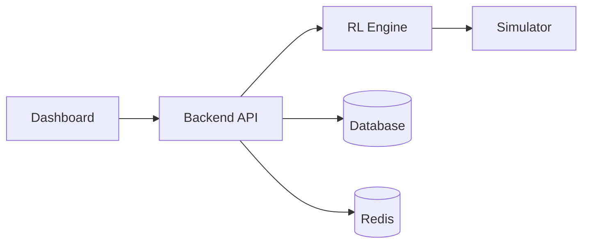
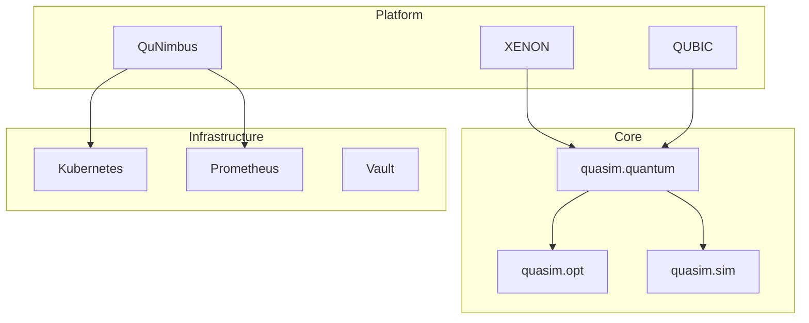

# Components

Detailed documentation of QRATUM's core components.

## Core Platform Components

### QRATUM Core (quasim/)

The central simulation engine providing quantum and classical algorithms.

```
quasim/
├── quantum/           # Quantum algorithms
├── opt/               # Classical optimization
├── sim/               # Simulation primitives
├── api/               # API interfaces
├── hcal/              # Hardware calibration
└── qunimbus/          # Distributed orchestration
```

#### Quantum Module

| File | Purpose |
|------|---------|
| `core.py` | Backend configuration and initialization |
| `vqe_molecule.py` | Variational Quantum Eigensolver |
| `qaoa_optimization.py` | Quantum Approximate Optimization Algorithm |

#### Key Classes

```python
# QuantumConfig - Backend configuration
class QuantumConfig:
    backend_type: str      # "simulator" or "ibmq"
    shots: int             # Measurement count
    seed: Optional[int]    # Reproducibility seed
    ibmq_token: str        # IBM Quantum token

# MolecularVQE - VQE for molecules
class MolecularVQE:
    def compute_h2_energy(
        bond_length: float,
        basis: str = "sto3g",
        max_iterations: int = 100
    ) -> VQEResult

# QAOA - Combinatorial optimization
class QAOA:
    def solve_maxcut(
        edges: list[tuple[int, int]],
        max_iterations: int = 100
    ) -> QAOAResult
```

---

### QuNimbus (quasim/qunimbus/)

Distributed multi-cloud orchestration engine.

#### Features

- Multi-cluster Kubernetes management
- Cross-cloud deployment (AWS, GCP, Azure)
- Workload scheduling and load balancing
- Federated identity and access

#### CLI Commands

```bash
# Deploy to cluster
qunimbus deploy --cluster prod-west --manifest deploy.yaml

# Check status
qunimbus status --cluster prod-west

# Scale deployment
qunimbus scale --cluster prod-west --replicas 5
```

---

### XENON (xenon/)

Biological intelligence subsystem for bio-mechanism simulation.

```
xenon/
├── bioinformatics/    # Genome sequencing
├── molecular_dynamics_lab/  # Molecular dynamics
└── cli.py             # Command-line interface
```

#### Features

- Genome sequencing analysis
- Molecular dynamics simulation
- Biological mechanism modeling

---

### QUBIC Visualization (qubic/)

3D rendering and visualization engine.

```
qubic/
├── visualization/     # Core rendering
├── qubic-viz/        # CLI tools
└── qubic-design-studio/  # Design tools
```

#### Features

- Real-time 3D visualization
- PBR shaders
- Animation export (MP4, GIF)

#### CLI Usage

```bash
qubic-viz render --input results.json --output viz.png
qubic-viz animate --input frames/ --output animation.mp4
```

---

### Autonomous Systems Platform (autonomous_systems_platform/)

Phase III reinforcement learning optimization.

```
autonomous_systems_platform/
├── services/
│   ├── backend/       # API service
│   └── frontend/      # Dashboard
├── infra/
│   └── k8s/          # Kubernetes manifests
├── observability/     # Monitoring
└── security/          # OAuth2, RBAC
```

#### Architecture



---

### Compliance Automation (compliance/)

Automated compliance verification and reporting.

```
compliance/
├── config/           # Configuration files
├── scripts/          # Automation scripts
├── policies/         # OPA Rego policies
├── matrices/         # Control matrices
└── templates/        # Report templates
```

#### Key Scripts

| Script | Purpose |
|--------|---------|
| `sbom_generator.py` | Generate SPDX SBOM |
| `mcdc_analyzer.py` | DO-178C MC/DC coverage |
| `export_scan.py` | ITAR/EAR scanning |

---

### Infrastructure (infra/)

Cloud and container infrastructure.

```
infra/
├── terraform/        # IaC definitions
├── k8s/             # Kubernetes manifests
├── kubefed/         # Federation configs
└── observability/   # Prometheus, Grafana
```

---

## Supporting Components

### Hardware Calibration (quasim/hcal/)

Hardware detection and calibration tools.

```bash
# Detect hardware
quasim-hcal detect --json

# Run calibration
quasim-hcal calibrate --device gpu0 --output calibration.json
```

### SDK (sdk/)

Language-specific SDKs.

```
sdk/
├── python/          # Python SDK (primary)
├── typescript/      # TypeScript SDK
└── ansys/           # Ansys adapter
```

### Integrations (integrations/)

Third-party tool integrations.

```
integrations/
├── adapters/        # File format adapters
│   ├── fluent/      # Ansys Fluent
│   ├── mapdl/       # PyMAPDL
│   └── comsol/      # COMSOL
├── benchmarks/      # Performance benchmarks
└── compliance/      # Export control
```

---

## Component Dependencies



## Configuration

Each component can be configured via:

1. YAML configuration files
2. Environment variables
3. Command-line arguments

See [Configuration Reference](../reference/configuration.md) for details.
