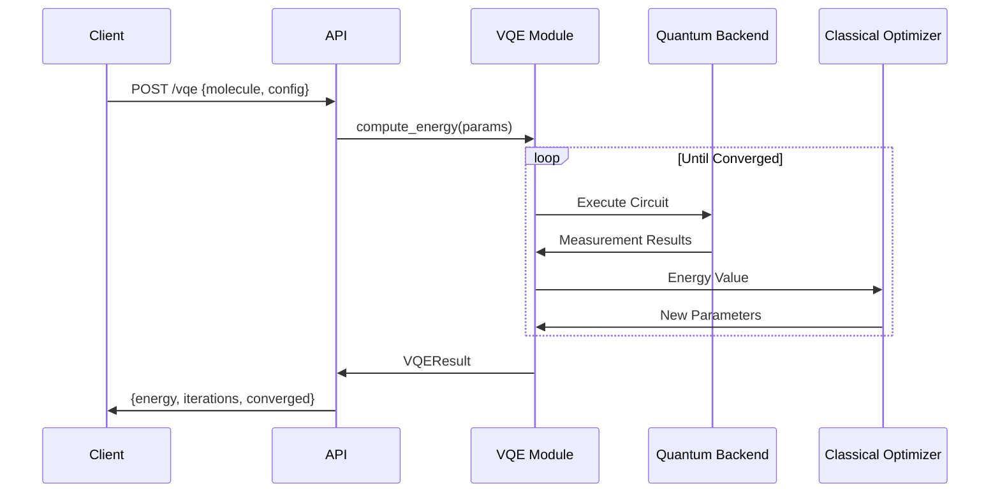
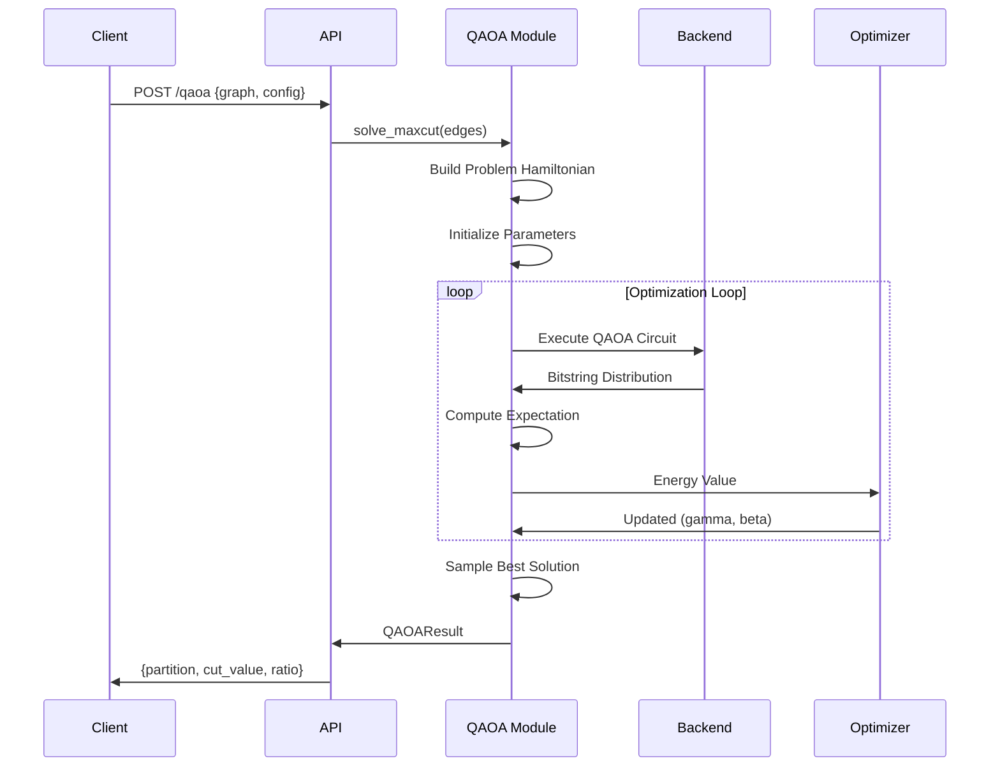
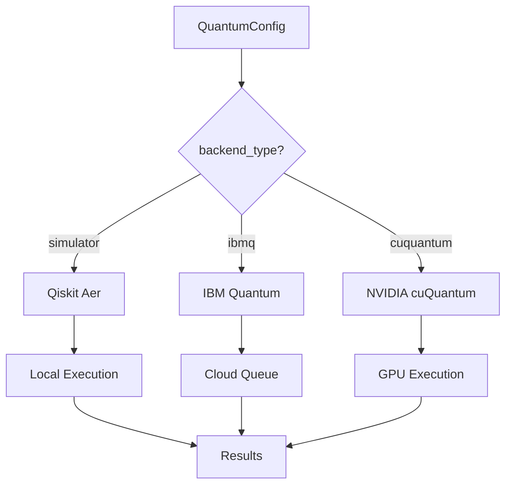
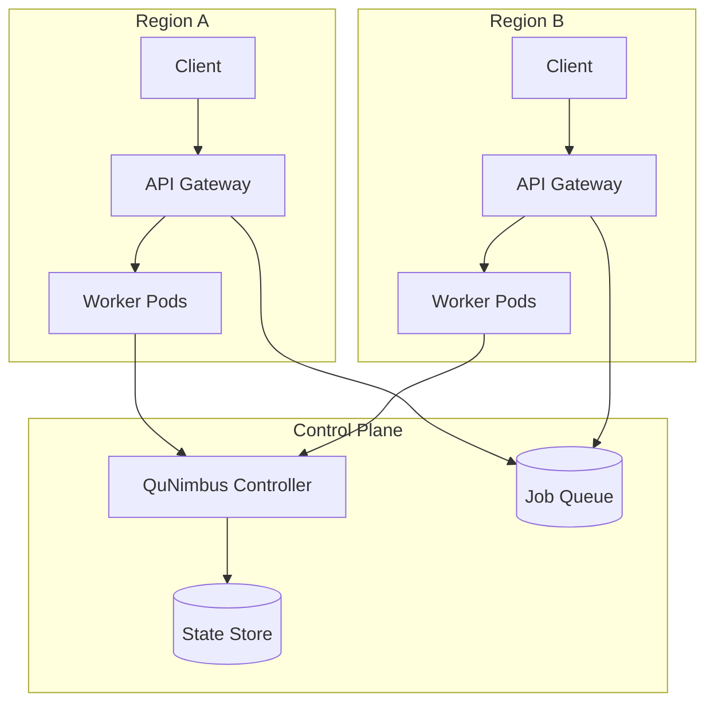
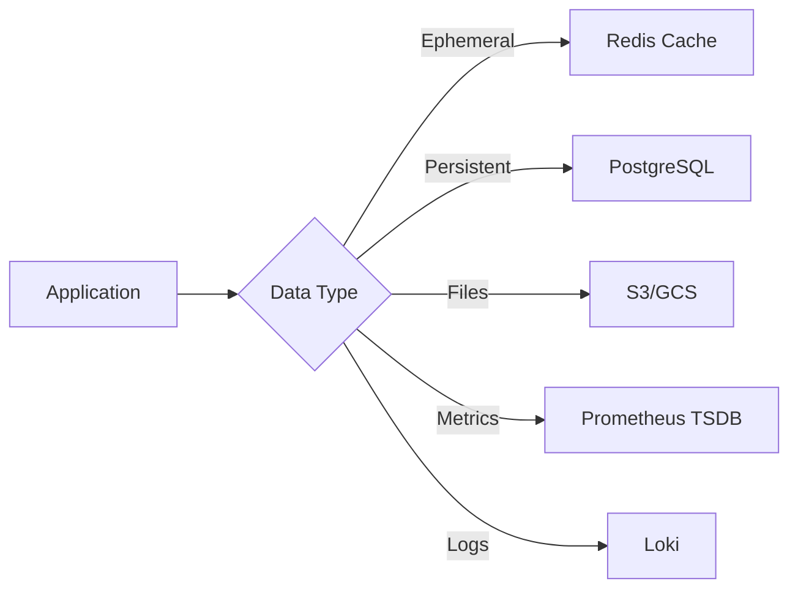
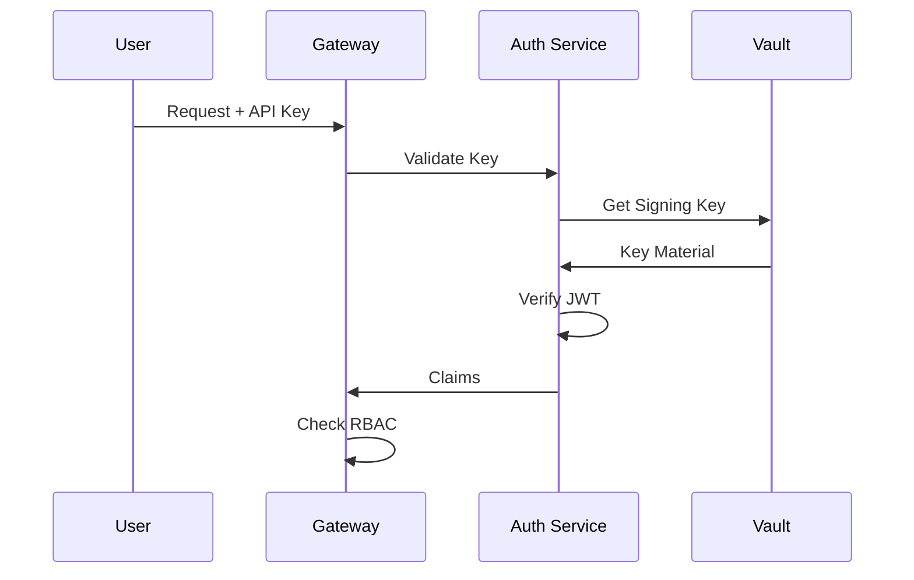

# Data Flow

Understanding how data flows through the QRATUM platform.

## Request Processing

### VQE Computation Flow



### QAOA Optimization Flow



## Data Transformations

### Molecule to Quantum Circuit

```
H₂ Molecule
    │
    ▼
┌─────────────────────┐
│ Molecular Geometry  │  bond_length = 0.735 Å
└─────────┬───────────┘
          │
          ▼
┌─────────────────────┐
│ Hamiltonian (PySCF) │  H = Σ h_pq a†_p a_q + ...
└─────────┬───────────┘
          │
          ▼
┌─────────────────────┐
│ Jordan-Wigner Map   │  Fermions → Qubits
└─────────┬───────────┘
          │
          ▼
┌─────────────────────┐
│ Qubit Hamiltonian   │  H = Σ c_i P_i (Paulis)
└─────────┬───────────┘
          │
          ▼
┌─────────────────────┐
│ Parameterized Ansatz│  |ψ(θ)⟩ = U(θ)|0⟩
└─────────┬───────────┘
          │
          ▼
┌─────────────────────┐
│ Quantum Circuit     │  Executable circuit
└─────────────────────┘
```

### Graph to QAOA Circuit

```
Graph G = (V, E)
    │
    ▼
┌─────────────────────┐
│ Problem Hamiltonian │  C = Σ (1-Z_iZ_j)/2
└─────────┬───────────┘
          │
          ▼
┌─────────────────────┐
│ Mixing Hamiltonian  │  B = Σ X_i
└─────────┬───────────┘
          │
          ▼
┌─────────────────────┐
│ QAOA Circuit        │  U_B U_C ... U_B U_C |+⟩^n
│ (p layers)          │
└─────────────────────┘
```

## Execution Backends

### Backend Selection Flow



### Simulator Pipeline

```
Parameters θ
    │
    ▼
┌─────────────────────┐
│ Build Circuit       │  Qiskit QuantumCircuit
└─────────┬───────────┘
          │
          ▼
┌─────────────────────┐
│ Compile to Backend  │  Transpile for Aer
└─────────┬───────────┘
          │
          ▼
┌─────────────────────┐
│ Execute (N shots)   │  Sample measurements
└─────────┬───────────┘
          │
          ▼
┌─────────────────────┐
│ Aggregate Results   │  Compute expectation
└─────────────────────┘
```

## Distributed Processing

### QuNimbus Data Flow



### Job Processing Flow

```
Job Submission
    │
    ▼
┌─────────────────────┐
│ API Gateway         │  Authenticate, validate
└─────────┬───────────┘
          │
          ▼
┌─────────────────────┐
│ Job Queue (Redis)   │  Priority queue
└─────────┬───────────┘
          │
          ▼
┌─────────────────────┐
│ Scheduler           │  Resource allocation
└─────────┬───────────┘
          │
    ┌─────┴─────┐
    │           │
    ▼           ▼
┌───────┐   ┌───────┐
│Worker │   │Worker │    Execute in parallel
│  1    │   │  2    │
└───┬───┘   └───┬───┘
    │           │
    └─────┬─────┘
          │
          ▼
┌─────────────────────┐
│ Result Aggregation  │
└─────────┬───────────┘
          │
          ▼
┌─────────────────────┐
│ Client Response     │
└─────────────────────┘
```

## Observability Data Flow

### Metrics Pipeline

```
Application
    │
    │ Prometheus client
    ▼
┌─────────────────────┐
│ /metrics endpoint   │  Expose metrics
└─────────┬───────────┘
          │
          │ HTTP scrape (30s)
          ▼
┌─────────────────────┐
│ Prometheus Server   │  Store time series
└─────────┬───────────┘
          │
          │ PromQL queries
          ▼
┌─────────────────────┐
│ Grafana Dashboard   │  Visualize
└─────────────────────┘
```

### Logging Pipeline

```
Application Log
    │
    │ stdout/stderr
    ▼
┌─────────────────────┐
│ Container Runtime   │  Capture logs
└─────────┬───────────┘
          │
          │ Fluentd/Promtail
          ▼
┌─────────────────────┐
│ Loki                │  Log aggregation
└─────────┬───────────┘
          │
          │ LogQL queries
          ▼
┌─────────────────────┐
│ Grafana             │  Search & visualize
└─────────────────────┘
```

## Data Persistence

### State Management



### Data Retention

| Data Type | Storage | Retention |
|-----------|---------|-----------|
| Job results | PostgreSQL | 90 days |
| Session cache | Redis | 24 hours |
| Metrics | Prometheus | 15 days |
| Logs | Loki | 30 days |
| Audit logs | S3 | 7 years |

## Security Data Flow

### Authentication



### Encryption

```
Data in Transit           Data at Rest
────────────────          ─────────────
                          
Client ──TLS 1.3──▶ API   PostgreSQL (AES-256)
API ──mTLS──▶ Service     Redis (Encrypted)
Service ──TLS──▶ DB       S3 (SSE-KMS)
```
