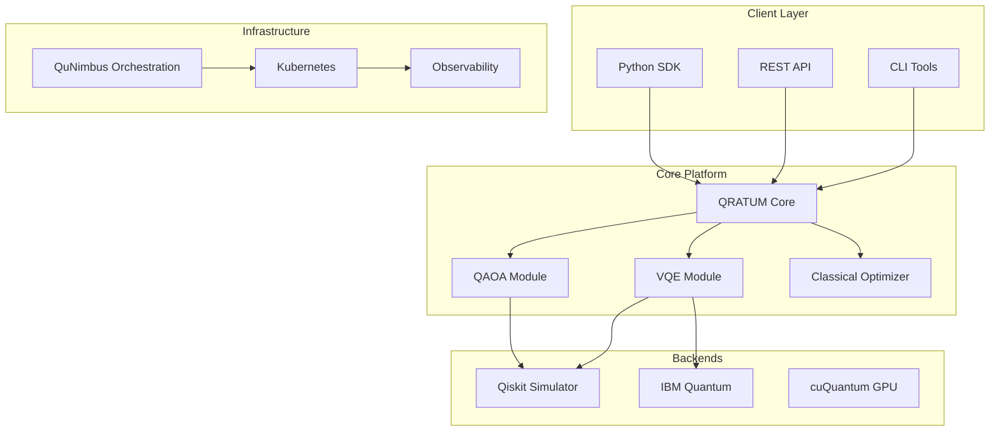

# Architecture

Understanding QRATUM's system architecture.

<div class="grid cards" markdown>

- :material-sitemap:{ .lg .middle } __System Overview__

    ---

    High-level architecture and design principles

    [:octicons-arrow-right-24: System Overview](system-overview.md)

- :material-puzzle:{ .lg .middle } __Components__

    ---

    Detailed component documentation

    [:octicons-arrow-right-24: Components](components.md)

- :material-transit-connection-variant:{ .lg .middle } __Data Flow__

    ---

    How data moves through the system

    [:octicons-arrow-right-24: Data Flow](data-flow.md)

</div>

## Architecture Principles

QRATUM is built on these core principles:

1. __Deterministic Reproducibility__ - All simulations reproducible via seed management
2. __Hybrid Quantum-Classical__ - Seamless integration of quantum and classical algorithms
3. __Certification-Ready__ - DO-178C Level A compliant design
4. __Modular Design__ - Clean separation of concerns
5. __Cloud-Native__ - Built for Kubernetes deployment

## High-Level Overview



## Repository Structure

```
QRATUM/
├── quasim/                    # Core simulation engine
│   ├── quantum/               # Quantum algorithms
│   │   ├── core.py            # Backend configuration
│   │   ├── vqe_molecule.py    # VQE implementation
│   │   └── qaoa_optimization.py  # QAOA implementation
│   ├── opt/                   # Classical optimization
│   ├── sim/                   # Simulation primitives
│   ├── api/                   # API interfaces
│   ├── hcal/                  # Hardware calibration
│   └── qunimbus/              # Distributed orchestration
├── autonomous_systems_platform/  # Phase III RL optimization
├── xenon/                     # Biological intelligence
├── qubic/                     # Visualization engine
├── compliance/                # Compliance automation
├── infra/                     # Infrastructure configs
├── tests/                     # Test suite
└── docs-site/                 # Documentation source
```

## Technology Stack

| Layer | Technology |
|-------|------------|
| Language | Python 3.10+, C++, CUDA, Rust |
| Quantum | Qiskit, PennyLane, cuQuantum |
| Infrastructure | Kubernetes, Docker, Terraform |
| Observability | Prometheus, Grafana, Loki |
| Security | Vault, OPA, Cilium |
| CI/CD | GitHub Actions |
