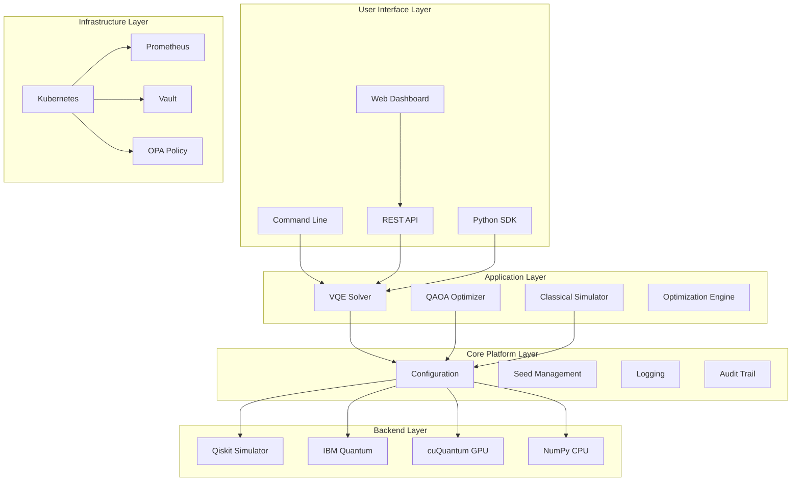
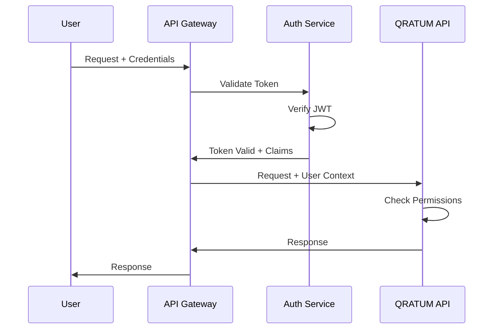

# System Overview

QRATUM is a hybrid quantum-classical simulation platform designed for regulated industries.

## Design Philosophy

### Certifiable Quantum-Classical Convergence (CQCC)

QRATUM created a new computational category by combining:

- **Quantum Performance**: Genuine quantum algorithms (VQE, QAOA)
- **Classical Reliability**: Deterministic, reproducible execution
- **Aerospace Certification**: DO-178C Level A compliance
- **Defense Compliance**: NIST 800-53, CMMC 2.0, DFARS

### Core Principles

1. **Transparency** - Honest about quantum limitations
2. **Validation** - All quantum results compared to classical
3. **Reproducibility** - Seed management for audit trails
4. **Modularity** - Quantum modules are optional dependencies
5. **NISQ-Aware** - Designed for noisy, limited-qubit devices

## Architecture Layers



## Layered Architecture

### 1. User Interface Layer

Entry points for interacting with QRATUM:

| Component | Description | Protocol |
|-----------|-------------|----------|
| CLI | Command-line tools | Local |
| REST API | HTTP endpoints | REST/JSON |
| Python SDK | Programmatic access | Python |
| Web Dashboard | Visual interface | HTTP |

### 2. Application Layer

Core business logic:

- **VQE Solver**: Variational Quantum Eigensolver for molecular simulation
- **QAOA Optimizer**: Combinatorial optimization
- **Classical Simulator**: NumPy-based numerical methods
- **Optimization Engine**: Classical parameter optimization (COBYLA, L-BFGS-B)

### 3. Core Platform Layer

Cross-cutting concerns:

- **Configuration**: YAML-based configuration management
- **Seed Management**: Reproducibility via deterministic seeding
- **Logging**: Structured logging for observability
- **Audit Trail**: Compliance-ready audit logging

### 4. Backend Layer

Execution backends:

| Backend | Type | Use Case |
|---------|------|----------|
| Qiskit Simulator | Quantum simulation | Development, testing |
| IBM Quantum | Real quantum hardware | Production (experimental) |
| cuQuantum GPU | GPU-accelerated simulation | High-performance |
| NumPy CPU | Classical computation | Fallback, validation |

### 5. Infrastructure Layer

Deployment and operations:

- **Kubernetes**: Container orchestration
- **Prometheus**: Metrics collection
- **Vault**: Secrets management
- **OPA**: Policy enforcement

## Deployment Topologies

### Local Development

```
┌─────────────────┐
│   Developer     │
│   Workstation   │
├─────────────────┤
│  Python venv    │
│  Qiskit Aer     │
│  NumPy          │
└─────────────────┘
```

### Docker Compose

```
┌─────────────────┐
│   Browser       │
└────────┬────────┘
         │
┌────────┴────────┐
│   Nginx Proxy   │
└────────┬────────┘
    ┌────┴────┐
    │         │
┌───┴───┐ ┌───┴───┐
│Backend│ │Frontend│
│ :8000 │ │ :8080 │
└───┬───┘ └───────┘
    │
┌───┴───┐
│ Redis │
└───────┘
```

### Kubernetes Production

```
┌────────────────────────────────────────┐
│            Load Balancer               │
└──────────────────┬─────────────────────┘
                   │
┌──────────────────┴─────────────────────┐
│              Ingress                    │
└──────────────────┬─────────────────────┘
                   │
    ┌──────────────┼──────────────┐
    │              │              │
┌───┴───┐     ┌────┴───┐     ┌───┴───┐
│API    │     │API     │     │API    │
│Pod 1  │     │Pod 2   │     │Pod 3  │
└───┬───┘     └────┬───┘     └───┬───┘
    │              │              │
    └──────────────┼──────────────┘
                   │
    ┌──────────────┴──────────────┐
    │                              │
┌───┴───┐                    ┌────┴────┐
│Redis  │                    │PostgreSQL│
│Cluster│                    │  HA     │
└───────┘                    └─────────┘
```

## Security Model

### Defense in Depth

```
┌─────────────────────────────────────────┐
│  Network Layer (Cilium CNI)             │
├─────────────────────────────────────────┤
│  API Gateway (Authentication)           │
├─────────────────────────────────────────┤
│  Service Mesh (mTLS)                    │
├─────────────────────────────────────────┤
│  Application (RBAC, Input Validation)   │
├─────────────────────────────────────────┤
│  Data (Encryption at Rest/Transit)      │
└─────────────────────────────────────────┘
```

### Authentication Flow



## Observability

### Metrics Pipeline

```
┌───────────┐     ┌───────────┐     ┌───────────┐
│ Application│────▶│Prometheus │────▶│  Grafana  │
│  Metrics  │     │   Server  │     │ Dashboard │
└───────────┘     └───────────┘     └───────────┘
```

### Key Metrics

| Metric | Description | Alert Threshold |
|--------|-------------|-----------------|
| `qratum_requests_total` | Total API requests | N/A |
| `qratum_request_duration_seconds` | Request latency | p99 > 5s |
| `qratum_errors_total` | Error count | > 10/min |
| `qratum_vqe_iterations` | VQE optimization iterations | > 1000 |
| `qratum_approximation_ratio` | QAOA approximation quality | < 0.5 |

## Next Steps

- [Components](components.md) - Detailed component documentation
- [Data Flow](data-flow.md) - How data moves through the system
- [Compliance](../compliance/index.md) - Security and compliance
