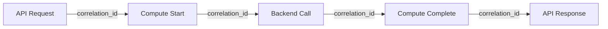

# Audit Trail

Documentation for QRATUM's audit trail and reproducibility features.

## Overview

QRATUM maintains comprehensive audit trails for compliance with DO-178C, NIST 800-53, and defense requirements.

## Reproducibility

### Seed Management

All QRATUM computations are reproducible via seed management:

```python
from quasim.quantum.core import QuantumConfig

# Same seed = same results
config = QuantumConfig(seed=42)
result1 = vqe.compute(config)

config = QuantumConfig(seed=42)
result2 = vqe.compute(config)

assert result1 == result2  # Guaranteed
```

### Reproducibility Guarantees

| Component | Reproducibility | Seed Required |
|-----------|-----------------|---------------|
| VQE | Deterministic | Yes |
| QAOA | Deterministic | Yes |
| Classical optimizer | Deterministic | Yes |
| NumPy operations | Deterministic | Yes |
| Qiskit simulator | Deterministic | Yes |
| Real quantum hardware | Probabilistic | N/A |

### Result Hashing

All results include cryptographic hashes for verification:

```python
@dataclass
class VQEResult:
    energy: float
    iterations: int
    converged: bool
    parameters: np.ndarray
    seed: int
    timestamp: datetime
    result_hash: str  # SHA-256 of all fields
    
    def verify(self) -> bool:
        """Verify result integrity."""
        computed_hash = sha256(self._serialize())
        return computed_hash == self.result_hash
```

## Audit Logging

### Log Format

All operations generate structured audit logs:

```json
{
  "timestamp": "2025-12-17T15:30:00.000Z",
  "level": "INFO",
  "logger": "quasim.quantum.vqe",
  "event": "computation_complete",
  "context": {
    "request_id": "req-abc123",
    "correlation_id": "corr-xyz789",
    "user_id": "system",
    "session_id": "sess-def456"
  },
  "operation": {
    "type": "vqe_compute",
    "module": "MolecularVQE",
    "method": "compute_h2_energy"
  },
  "parameters": {
    "bond_length": 0.735,
    "basis": "sto3g",
    "shots": 1024,
    "seed": 42,
    "max_iterations": 100
  },
  "result": {
    "energy": -1.136189,
    "iterations": 47,
    "converged": true,
    "result_hash": "sha256:abc123def456..."
  },
  "metrics": {
    "duration_ms": 1234,
    "circuit_depth": 12,
    "qubit_count": 4
  }
}
```

### Log Categories

| Category | Description | Retention |
|----------|-------------|-----------|
| `security` | Authentication, authorization | 1 year |
| `audit` | Data access, modifications | 7 years |
| `compliance` | Regulatory events | 7 years |
| `operation` | Computations, API calls | 90 days |
| `debug` | Troubleshooting (if enabled) | 7 days |

### Logging Configuration

```yaml
# config/logging.yaml
logging:
  version: 1
  
  formatters:
    json:
      class: pythonjsonlogger.jsonlogger.JsonFormatter
      format: "%(timestamp)s %(level)s %(name)s %(message)s"
      
  handlers:
    console:
      class: logging.StreamHandler
      formatter: json
      stream: ext://sys.stdout
      
    audit_file:
      class: logging.handlers.RotatingFileHandler
      formatter: json
      filename: /var/log/qratum/audit.log
      maxBytes: 104857600  # 100MB
      backupCount: 100
      
    loki:
      class: logging_loki.LokiHandler
      url: http://loki:3100/loki/api/v1/push
      tags:
        application: qratum
        
  loggers:
    quasim.audit:
      level: INFO
      handlers: [audit_file, loki]
      propagate: false
      
    quasim.security:
      level: INFO
      handlers: [audit_file, loki]
      propagate: false
```

## Event Tracking

### Tracked Events

| Event | Trigger | Data Captured |
|-------|---------|---------------|
| `user.login` | Authentication | User ID, IP, method |
| `user.logout` | Session end | User ID, duration |
| `api.request` | API call | Method, path, params |
| `api.response` | API response | Status, duration |
| `compute.start` | Computation begins | Type, parameters |
| `compute.complete` | Computation ends | Result, metrics |
| `config.change` | Configuration update | Before/after values |
| `security.violation` | Policy violation | Details, severity |

### Event Correlation



## Data Provenance

### Computation Lineage

Track the full lineage of every result:

```yaml
Lineage:
  result_id: "res-abc123"
  created: "2025-12-17T15:30:00Z"
  
  source:
    code_version: "v2.0.0"
    git_commit: "abc123def"
    dependencies:
      qiskit: "1.0.2"
      numpy: "1.26.2"
    environment:
      python: "3.11.5"
      platform: "linux-x86_64"
      
  parameters:
    seed: 42
    shots: 1024
    bond_length: 0.735
    
  inputs:
    molecule: "H2"
    basis: "sto3g"
    
  outputs:
    energy: -1.136189
    hash: "sha256:abc123..."
    
  reproducibility:
    verified: true
    verification_date: "2025-12-17T15:35:00Z"
```

### Data Flow Audit

```
Input Data
    │
    ▼
┌─────────────────────┐
│ Input Validation    │──▶ Log: input_validated
└──────────┬──────────┘
           │
           ▼
┌─────────────────────┐
│ Preprocessing       │──▶ Log: preprocessing_complete
└──────────┬──────────┘
           │
           ▼
┌─────────────────────┐
│ Quantum Circuit     │──▶ Log: circuit_created
└──────────┬──────────┘
           │
           ▼
┌─────────────────────┐
│ Backend Execution   │──▶ Log: execution_complete
└──────────┬──────────┘
           │
           ▼
┌─────────────────────┐
│ Postprocessing      │──▶ Log: postprocessing_complete
└──────────┬──────────┘
           │
           ▼
┌─────────────────────┐
│ Result Storage      │──▶ Log: result_stored
└─────────────────────┘
```

## Compliance Reporting

### Automated Reports

```bash
# Generate audit report
python compliance/scripts/generate_audit_report.py \
  --start-date 2025-01-01 \
  --end-date 2025-12-31 \
  --output audit_report_2025.pdf

# Generate access report
python compliance/scripts/generate_access_report.py \
  --period quarterly \
  --output q4_access_report.pdf
```

### Report Types

| Report | Frequency | Contents |
|--------|-----------|----------|
| Access Audit | Quarterly | Who accessed what |
| Change Audit | Monthly | Configuration changes |
| Security Audit | Weekly | Security events |
| Computation Audit | On-demand | Specific result provenance |

## Retention Policy

### Data Retention

| Data Type | Retention | Storage |
|-----------|-----------|---------|
| Audit logs | 7 years | S3 Glacier |
| Security logs | 1 year | S3 + Loki |
| Computation results | 90 days | PostgreSQL |
| Configuration history | Permanent | Git |
| User sessions | 30 days | Redis |

### Archival Process

```yaml
Archival:
  frequency: daily
  time: 02:00 UTC
  
  process:
    - Export logs older than retention threshold
    - Compress with gzip
    - Encrypt with AES-256
    - Upload to S3 Glacier
    - Verify checksum
    - Delete local copies
    
  verification:
    - Monthly integrity check
    - Annual restore test
```

## Query Interface

### Log Search

```bash
# Search audit logs
qratum-audit search \
  --query "user.login" \
  --start "2025-12-01" \
  --end "2025-12-31" \
  --user "admin@example.com"

# Export results
qratum-audit export \
  --query "compute.complete" \
  --format csv \
  --output computations.csv
```

### Grafana Queries

```promql
# Failed authentication attempts
sum(rate(qratum_auth_failures_total[5m])) by (user)

# Computation count by type
sum(increase(qratum_computations_total[1d])) by (type)

# Average computation duration
avg(qratum_computation_duration_seconds) by (type)
```

## Contact

For audit and compliance inquiries:

- **Compliance Officer**: <compliance@quasim.example.com>
- **Security Team**: <security@quasim.example.com>
