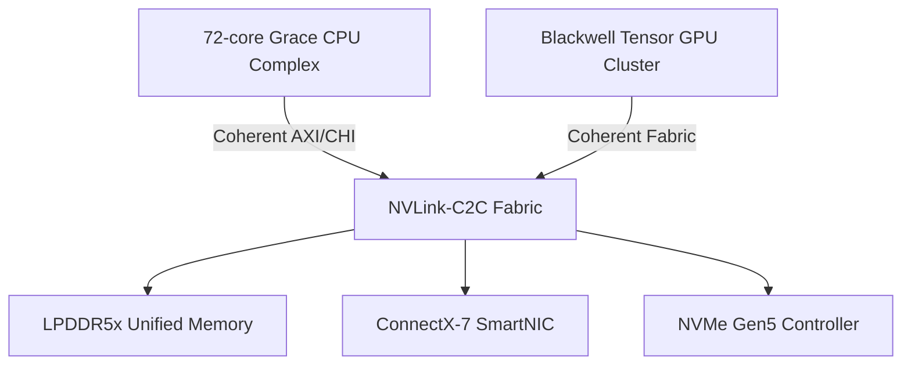

# Architecture Overview

## System Architecture

The GB10 superchip couples a high-core-count Grace-inspired CPU complex with a Blackwell-style GPU cluster through a coherent NVLink-C2C fabric. The CPU delivers Arm v9 SVE2 compute with advanced power-state management, while the GPU exposes SIMT scheduling, 5th generation tensor cores, and ray-tracing acceleration.

The unified fabric allows every agent to operate in a shared virtual address space, enabling low-latency data exchange between AI and quantum simulation workloads.

## Hybrid Compute Architecture

### CPU Complex (Grace-Inspired)

- **72 Arm v9 Cores**: High-performance compute with SVE2 (Scalable Vector Extensions)
- **Advanced Power Management**: Dynamic voltage/frequency scaling for efficiency
- **Coherent Memory Interface**: Direct access to unified memory pool via NVLink-C2C
- **Classical Preprocessing**: Optimized for quantum circuit compilation and tensor graph planning

### GPU Cluster (Blackwell-Style)

- **5th Generation Tensor Cores**: FP8/FP16/FP32 mixed-precision for quantum state vectors
- **SIMT Scheduling**: Massively parallel thread execution for tensor contraction
- **Ray-Tracing Acceleration**: Real-time immersive visualization support
- **Quantum Kernel Dispatch**: Specialized command buffers for tensor network operations

### Unified Memory & Interconnect

- **LPDDR5x Memory Pool**: Shared virtual address space across CPU/GPU
- **NVLink-C2C Fabric**: 900 GB/s bidirectional coherent interconnect
- **Zero-Copy Transfers**: Eliminate data movement overhead for quantum-classical workflows
- **RDMA Support**: ConnectX-7 SmartNIC for distributed simulation across nodes

## Software Stack Capabilities

### Quantum Runtime Layer

- **Tensor Network Contraction**: Optimized algorithms for quantum state simulation
- **Circuit Compilation**: JIT translation from quantum IR to GPU command streams
- **Noise Modeling**: Decoherence and gate error simulation for realistic results
- **Observable Measurement**: Statistical sampling and expectation value computation

### AI/ML Integration

- **JAX Integration**: Differentiable quantum circuits with automatic differentiation
- **PyTorch Support**: Hybrid classical-quantum neural networks
- **SuperTransformer Layers**: Quantum-inspired attention mechanisms
- **Attractor CFT Kernels**: Phase space analysis for chaotic system modeling

### Kubernetes Orchestration

- **GPU Scheduling**: Automated workload placement on accelerated nodes
- **Multi-Tenancy**: Namespace isolation with quota enforcement
- **Observability**: Prometheus/Grafana dashboards for quantum job metrics
- **Security**: Vault integration for quantum key management and secrets

### Developer APIs

- **Python SDK (`quasim`)**: High-level quantum circuit simulation interface
- **C++ Runtime (`libquasim`)**: Low-level tensor operation primitives
- **REST APIs**: Cloud-native quantum job submission and monitoring
- **CUDA Compatibility**: Drop-in replacement for existing CUDA-based quantum codes

## Performance Characteristics

### Throughput

- **Quantum Circuit Simulation**: Up to 40 qubits with full state vector on single GPU
- **Tensor Contraction**: 10+ TFLOPS sustained throughput with FP16 precision
- **Classical Inference**: 100K+ inferences/sec for transformer models
- **Memory Bandwidth**: 900 GB/s coherent transfers, 8 TB/s aggregate HBM bandwidth

### Latency

- **Circuit Compilation**: <10ms for typical 20-qubit circuits
- **GPU Kernel Launch**: <100μs overhead for tensor operations
- **Measurement Sampling**: <1ms for 10K shots statistical collection
- **Visualization Updates**: 60 FPS real-time rendering for dashboard streams

### Scalability

- **Multi-GPU**: Linear scaling up to 8 GPUs per node via NVLink
- **Multi-Node**: Near-linear scaling with RDMA interconnect for distributed simulation
- **Kubernetes**: Horizontal pod autoscaling based on quantum job queue depth
- **Cloud-Native**: Compatible with AWS EKS, Azure AKS, and GCP GKE

## Security & Compliance

### Data Protection

- **Encryption at Rest**: AES-256 for quantum simulation results
- **Encryption in Transit**: TLS 1.3 for all API communication
- **Secure Enclaves**: Confidential computing support for sensitive workloads
- **Key Management**: HashiCorp Vault integration for quantum key distribution

### Access Control

- **RBAC**: Kubernetes role-based access for quantum resources
- **OPA Policies**: Gatekeeper constraints for regulatory compliance
- **Audit Logging**: Immutable audit trail for all quantum operations
- **MFA Support**: Multi-factor authentication for critical operations

### Certifications

- **SOC2 Type II Ready**: Control frameworks for quantum simulation service
- **ISO 27001 Ready**: Information security management system
- **HIPAA Compatible**: PHI protection for healthcare digital twins
- **FedRAMP Trajectory**: Government cloud security compliance path
