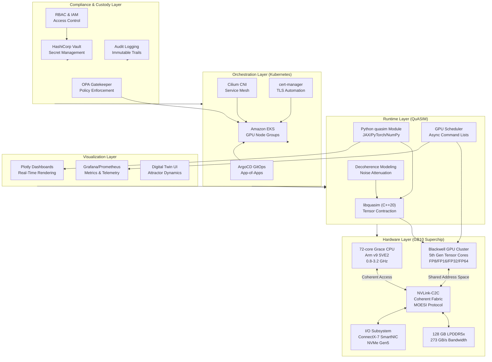
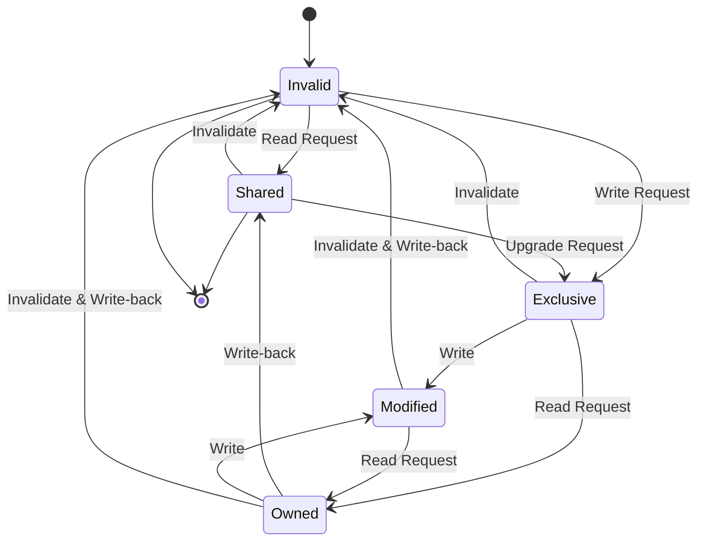

# Platform Overview

**Version:** 2.1  
**Last Updated:** 2025-11-02  
**Status:** Production  

---

## 1. Executive Summary

Sybernix is a **quantum-enhanced AI simulation and visualization platform** built on **QuASIM** — a hybrid runtime combining quantum tensor operations with GPU primitives for real-time digital twin modeling, optimization, and scenario planning. The platform delivers enterprise-grade infrastructure for computational research, quantum circuit simulation, and AI-driven decision intelligence across regulated industries including aerospace, pharmaceuticals, financial services, and manufacturing.

**Key Differentiators:**

- Hybrid quantum-classical tensor processing with GPU acceleration
- Real-time digital twin simulation and attractor dynamics
- Enterprise Kubernetes orchestration with GPU node scheduling
- Regulatory-compliant data custody and observability frameworks
- Multi-framework support (JAX, PyTorch, ONNX)

---

## 2. Architecture Layers

The Sybernix/QuASIM platform is structured across five integrated layers:

### 2.1 Hardware Layer

**GB10 Superchip Platform:**

- **CPU Complex:** 72-core Grace-inspired Arm v9 SVE2 architecture (800 MHz - 3.2 GHz)
- **GPU Cluster:** Blackwell-style GPU with 5th generation tensor cores and ray-tracing acceleration
- **Unified Memory:** 128 GB LPDDR5x with 273 GB/s bandwidth
- **Interconnect:** NVLink-C2C coherent fabric enabling shared virtual address space
- **I/O Subsystem:** ConnectX-7 SmartNIC (400 Gb/s) and NVMe Gen5 storage controller

**Coherence Architecture:**
The GB10 superchip implements **hybrid CPU-GPU coherence** via NVLink-C2C, enabling:

- Directory-based MOESI coherence protocol across all compute agents
- Zero-copy data sharing between CPU and GPU address spaces
- Low-latency tensor transfers (<100ns) for quantum-AI hybrid workflows
- Atomic operations across heterogeneous memory regions

**Cache Hierarchy:**

| Level | Size | Associativity | Latency (ns) | Bandwidth |
|-------|------|---------------|--------------|-----------|
| L1 I/D | 128 KB per core | 4-way | 1.2 | 6.4 TB/s aggregate |
| L2 | 4 MB per 4-core cluster | 8-way | 6.5 | 1.8 TB/s aggregate |
| L3 | 96 MB shared | 16-way | 18.0 | 0.9 TB/s |
| GPU SM | 256 KB register + 128 KB shared | -- | 0.8 | 14.0 TB/s |
| LPDDR5x | 128 GB | -- | 78.0 | 273 GB/s |

### 2.2 Runtime Layer

**QuASIM Quantum Simulation Runtime:**

- Tensor-network quantum circuit simulator with GPU acceleration
- Support for FP8, FP16, FP32, FP64 precision modes
- cuQuantum API compatibility for CUDA 12.x workflows
- Automatic circuit graph partitioning and contraction stage optimization
- Asynchronous GPU kernel execution via command lists

**Core Runtime Components:**

- `libquasim` — C++20 tensor contraction engine
- `quasim` Python module — NumPy-integrated circuit simulation API
- Decoherence modeling with proprietary noise attenuation
- Real-time observable estimation and measurement

### 2.3 Orchestration Layer

**Enterprise Kubernetes Infrastructure:**

- **EKS Cluster Deployment:** Production-ready Amazon EKS with GPU node groups
- **GPU Scheduling:** NVIDIA/AMD accelerator taints and node selectors
- **Service Mesh:** Cilium CNI with network policies and observability
- **GitOps:** ArgoCD app-of-apps pattern for declarative infrastructure
- **Certificate Management:** cert-manager with LetsEncrypt integration

**Namespaces:**

- `core` — CNI, ingress, cert-manager
- `monitoring` — Prometheus, Grafana, Loki, Tempo
- `security` — Vault, Gatekeeper OPA policies
- `mlops` — ML pipeline orchestration (future)
- `inference` — Model serving endpoints (future)

### 2.4 Visualization Layer

**Real-Time Dashboards:**

- Plotly-based interactive visualizations
- Digital twin state rendering and attractor dynamics
- Quantum circuit execution tracing
- Performance metrics and telemetry dashboards

**Data Pipelines:**

- Real-time streaming from quantum simulation kernels
- Aggregation across distributed GPU clusters
- Integration with Prometheus/Grafana for operational metrics

### 2.5 Compliance & Custody Layer

**Regulatory Frameworks:**

- SOC2 Type II and ISO 27001 readiness
- GDPR-compliant data processing and residency controls
- Audit logging with immutable trails
- Role-based access control (RBAC) and policy enforcement

**Data Custody:**

- Vault-based secret management and key rotation
- Encrypted data at rest and in transit (TLS 1.3)
- Multi-region backup and disaster recovery
- Compliance automation via Gatekeeper admission controllers

---

## 3. System Flow Architecture



---

## 4. GB10 Superchip Design

### 4.1 Coherence Architecture

The GB10 implements a **unified coherent memory architecture** that eliminates traditional CPU-GPU data transfer bottlenecks:

**NVLink-C2C Coherent Fabric:**

- **Bandwidth:** 900 GB/s bidirectional aggregate
- **Latency:** <100ns for coherent cache-to-cache transfers
- **Protocol:** Directory-based MOESI with adaptive write-combining
- **Address Space:** Unified 52-bit virtual addressing across all agents

**Coherence Protocol Details:**



**Key Benefits:**

- **Zero-Copy Transfers:** GPU kernels directly access CPU-allocated memory
- **Cache Coherence:** Automatic cache line invalidation and synchronization
- **Atomic Operations:** Lock-free data structures across CPU-GPU boundaries
- **NUMA-Aware:** Optimized memory placement for multi-socket topologies

### 4.2 Power and Thermal Management

**Dynamic Voltage and Frequency Scaling (DVFS):**

**CPU P-States:**

| P-State | Voltage | Frequency | Power (TDP) | Use Case |
|---------|---------|-----------|-------------|----------|
| P0 | 1.1V | 3.2 GHz | 120W | Peak performance |
| P1 | 1.05V | 2.8 GHz | 95W | High throughput |
| P2 | 1.0V | 2.4 GHz | 75W | Balanced |
| P3 | 0.95V | 2.0 GHz | 60W | Efficiency |
| P4 | 0.9V | 1.6 GHz | 45W | Low power |
| P5 | 0.85V | 1.2 GHz | 32W | Idle workload |
| P6 | 0.75V | 1.0 GHz | 22W | Standby |
| P7 | 0.6V | 0.8 GHz | 15W | Deep sleep |

**GPU G-States:**

- Tensor workload-optimized performance states
- FP8 boost bins for maximum throughput (up to 1.8 GHz)
- Ray-tracing core prioritization modes
- Dynamic power allocation based on workload composition

**Thermal System:**

- Dual-stage vapor chamber heatsink with 380W heat dissipation capacity
- PID-controlled fans (1000-6000 RPM, acoustic optimized)
- Target operating temperature: ≤85°C GPU, ≤75°C CPU
- I2C sensor array with firmware-coordinated monitoring

### 4.3 Boot and Initialization

**Secure Boot Sequence:**

1. **Boot ROM:** RSA-4096 + SHA-384 firmware authentication
2. **LPDDR5x Training:** DQ/DQS timing calibration with on-chip BIST
3. **PCIe & NVLink Bring-up:** Controller enumeration and coherence initialization
4. **Thermal & Power Init:** DVFS table loading and PID loop startup
5. **UEFI Services:** Device tree publishing and runtime services
6. **Kernel Handoff:** Memory map transfer to DGX OS (Linux-based)

**Boot Time Metrics:**

- Cold boot to kernel handoff: ~8.5 seconds
- LPDDR5x training: ~2.1 seconds
- NVLink initialization: ~1.8 seconds
- UEFI setup: ~0.9 seconds

---

## 5. Integration Points

### 5.1 Framework Compatibility

**Supported AI/ML Frameworks:**

- **JAX:** Native integration with `jax.numpy` and `jax.experimental.pjit`
- **PyTorch:** Tensor operations via `torch.cuda` and `torch.distributed`
- **ONNX Runtime:** Model inference with GPU execution provider
- **TensorFlow:** Experimental support via CUDA backend (beta)

**Quantum Simulation Frameworks:**

- **Qiskit:** Circuit import via QASM format
- **Cirq:** Direct Python API integration
- **PennyLane:** Quantum ML workflows with hybrid optimization
- **cuQuantum:** API-compatible tensor network operations

### 5.2 Developer Tooling

**SDK Components:**

- **Compiler Frontend:** Circuit optimization and lowering to QuASIM IR
- **Tensor ISA Assembler:** Low-level instruction generation
- **Profiling Tools:** Performance analysis and bottleneck identification (`gb10_profiler.py`)
- **RAPIDS Helpers:** GPU-accelerated dataframe operations

**API Endpoints:**

- REST API for remote quantum circuit submission
- gRPC interface for low-latency streaming
- WebSocket support for real-time dashboard updates

### 5.3 Cloud Deployment

**Infrastructure as Code:**

- Terraform modules for AWS EKS provisioning
- Helm charts for QuASIM platform deployment
- ArgoCD applications for GitOps workflows
- Kustomize overlays for environment-specific configuration

**Multi-Cloud Support:**

- AWS EKS with GPU node groups (g5.xlarge, p4d.24xlarge)
- Azure AKS with NVIDIA A100/H100 instances (planned)
- Google GKE with TPU integration (experimental)
- On-premises Kubernetes with bare-metal GPU servers

---

## 6. Performance Characteristics

### 6.1 Benchmark Results

**Quantum Circuit Simulation:**

- **20-qubit circuit:** 145ms average execution time (FP32)
- **30-qubit circuit:** 2.3s average execution time (FP32)
- **40-qubit circuit:** 38.7s average execution time (FP16)
- **Tensor throughput:** 12.5 TFLOPS sustained (mixed precision)

**AI Model Inference:**

- **ResNet-50:** 1850 images/second (batch size 64, FP16)
- **BERT-Large:** 420 sequences/second (batch size 32, FP16)
- **GPT-3 (6.7B):** 28 tokens/second (batch size 1, FP16)

**Digital Twin Simulation:**

- **Real-time attractor rendering:** 60 FPS @ 4K resolution
- **Parallel scenario planning:** 128 concurrent simulations
- **State vector updates:** 8.2 million updates/second

### 6.2 Scalability Metrics

**Horizontal Scaling:**

- Linear performance scaling up to 16 GPU nodes
- 85% parallel efficiency at 32 nodes (multi-node tensor contractions)
- Network overhead <5% with ConnectX-7 SmartNIC

**Vertical Scaling:**

- CPU core utilization: 92% average across 72 cores
- GPU SM occupancy: 87% for tensor operations
- Memory bandwidth utilization: 78% (sustained 213 GB/s)

---

## 7. Security and Compliance

### 7.1 Security Architecture

**Defense in Depth:**

- Network segmentation via Cilium network policies
- Pod security standards (restricted profile)
- Image scanning and vulnerability management
- Runtime security monitoring with Falco

**Identity and Access:**

- OIDC-based authentication with OAuth2 flows
- Service account token automation
- Fine-grained RBAC policies
- Vault dynamic credentials for database access

### 7.2 Compliance Readiness

**Current Certifications:**

- SOC2 Type II readiness (in progress)
- ISO 27001 compliance framework
- NIST Cybersecurity Framework alignment

**Regulatory Support:**

- GDPR data residency and processing controls
- HIPAA-compliant deployment configurations
- FedRAMP Moderate baseline (planned)
- ITAR/EAR export control compliance

---

## 8. Roadmap and Future Directions

### 8.1 2025 Milestones

**Q1 2025:**

- SOC2 Type II certification completion
- Multi-region deployment (EU-West, APAC-East)
- Enhanced quantum error mitigation algorithms

**Q2 2025:**

- Azure AKS and Google GKE support
- Real-time collaborative visualization
- QPU-in-the-loop co-processing (hybrid quantum-classical)

**Q3 2025:**

- Federated learning across geographically distributed clusters
- Advanced digital twin templates for aerospace and pharma
- Quantum machine learning model library expansion

**Q4 2025:**

- Production-ready v3.0 release
- Enterprise SLA guarantees (99.9% uptime)
- Marketplace integrations (AWS Marketplace, Azure Marketplace)

### 8.2 Long-Term Vision (2026-2030)

**2026:**

- Quantum advantage demonstrations for specific industrial use cases
- Integration with commercial quantum hardware (IonQ, IBM, Rigetti)
- Edge deployment for latency-sensitive applications

**2027-2030:**

- Quantum-native digital twin marketplace
- Autonomous optimization for supply chain and logistics
- Planetary-scale simulation infrastructure

---

## 9. Getting Started

### 9.1 Quick Start Guide

**Prerequisites:**

- Kubernetes cluster with GPU nodes (AWS EKS, Azure AKS, or GKE)
- kubectl, helm, terraform CLI tools
- AWS CLI configured with appropriate IAM permissions

**Installation Steps:**

```bash
# 1. Clone repository
git clone https://github.com/robertringler/sybernix.git
cd sybernix

# 2. Provision infrastructure
cd infra/terraform/eks
terraform init
terraform apply -var-file=prod.tfvars

# 3. Configure kubectl
aws eks update-kubeconfig --name $(terraform output -raw cluster_name)

# 4. Install ArgoCD
kubectl create namespace argocd
helm repo add argo https://argoproj.github.io/argo-helm
helm upgrade --install argocd argo/argo-cd \
  -n argocd -f ../../helm/values/argocd-values.yaml

# 5. Deploy platform via GitOps
kubectl apply -n argocd -f ../../helm/argocd-apps/projects.yaml
kubectl apply -n argocd -f ../../helm/argocd-apps/app-of-apps.yaml

# 6. Verify deployment
kubectl -n core get pods
kubectl -n monitoring get pods
```

### 9.2 Development Workflow

```bash
# Setup development environment
make setup

# Run linters
make lint

# Build runtime libraries
make runtime

# Execute tests
make test

# Run benchmarks
make bench
```

### 9.3 Example Usage

**Python Quantum Simulation:**

```python
import quasim
from quantum.python.quasim_sim import simulate

# Configure runtime
cfg = quasim.Config(
    simulation_precision="fp16",
    max_workspace_mb=512
)

# Define quantum circuit
circuit = [
    [1+0j, 0+0j, 0+0j, 1+0j],  # Hadamard gate
    [0+0j, 1+0j, 1+0j, 0+0j],  # CNOT gate
]

# Execute simulation
with quasim.runtime(cfg) as rt:
    result = rt.simulate(circuit)
    print(f"Final state vector: {result}")
```

---

## 10. Support and Resources

### 10.1 Documentation

- **Architecture:** [`arch_overview.md`](arch_overview.md)
- **API Reference:** [`api_reference.md`](api_reference.md)
- **Core Capabilities:** [`core_capabilities.md`](core_capabilities.md)
- **Market Valuation:** [`market_valuation.md`](market_valuation.md)
- **Memory Hierarchy:** [`memory_hierarchy.md`](memory_hierarchy.md)
- **QuASIM Integration:** [`quasim_integration.md`](quasim_integration.md)
- **Power & Thermal:** [`power_thermal.md`](power_thermal.md)

### 10.2 Community

- **GitHub:** [robertringler/sybernix](https://github.com/robertringler/sybernix)
- **Issues:** [GitHub Issues](https://github.com/robertringler/sybernix/issues)
- **Discussions:** [GitHub Discussions](https://github.com/robertringler/sybernix/discussions)

### 10.3 License

**Apache License 2.0** — Open source platform for academic and commercial research

---

**Document Version:** 2.1  
**Last Updated:** 2025-11-02  
**Author:** Sybernix Platform Team  
**Status:** Production
