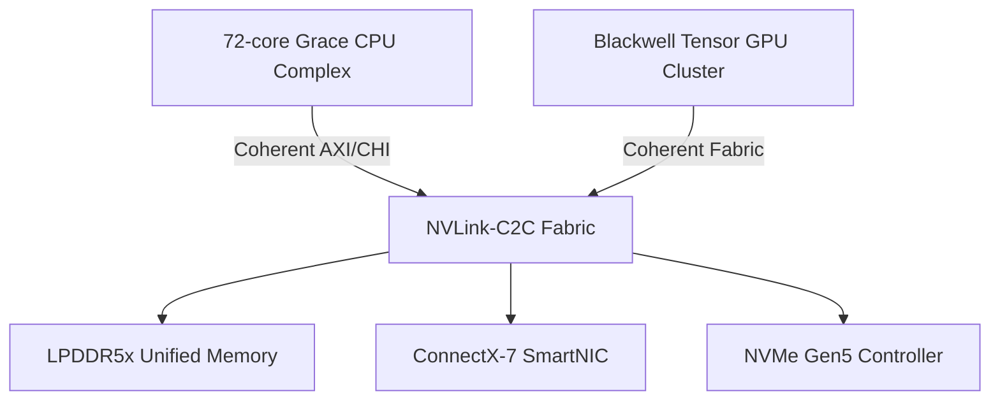
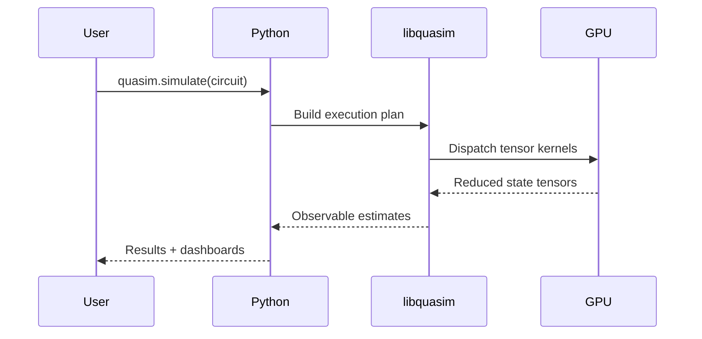

# QuASIM Capabilities and Specifications Overview

## Executive Summary

QuASIM (Quantum Accelerated Simulation) is a tensor-network quantum simulation runtime integrated into the GB10 Grace-Blackwell superchip platform. It delivers hardware-accelerated quantum circuit simulation through GPU tensor primitives with cuQuantum-compatible APIs, enabling hybrid CPU-GPU workflows for AI and quantum simulation workloads.

## System Architecture

### Hardware Platform: GB10 Superchip

The GB10 platform integrates:



**Key Components:**

- **CPU Complex:** 72-core Grace-inspired Arm v9 SVE2 architecture
- **GPU Cluster:** Blackwell-style SIMT scheduling with 5th generation tensor cores
- **Interconnect:** Coherent NVLink-C2C fabric enabling shared virtual address space
- **Memory:** 128 GB unified LPDDR5x with 273 GB/s bandwidth
- **I/O:** ConnectX-7 SmartNIC and NVMe Gen5 storage controller

### Memory Hierarchy Specifications

| Level | Size | Associativity | Latency (ns) | Bandwidth |
|-------|------|---------------|--------------|-----------|
| L1I/L1D | 128 KB per core | 4-way | 1.2 | 6.4 TB/s aggregate |
| L2 | 4 MB slice (per 4 cores) | 8-way | 6.5 | 1.8 TB/s aggregate |
| L3 | 96 MB shared | 16-way | 18.0 | 0.9 TB/s |
| GPU SM | 256 KB register file + 128 KB shared mem | -- | 0.8 | 14.0 TB/s |
| HBM/LPDDR5x | 128 GB | -- | 78.0 | 273 GB/s |

**Memory Model:**

- Directory-based MOESI coherence protocol
- Unified memory accessible by all CPU and GPU agents
- Adaptive write-combining and command reordering
- Explicit residency hints via `gb10_mm` driver
- Large page mapping support for tensor workloads

## QuASIM Runtime Capabilities

### Core Features

1. **Circuit Capture** — Python API accepts quantum circuits from JAX or PyTorch and lowers them to QuASIM IR
2. **Tensor Planning** — Automatic circuit graph partitioning into contraction stages
3. **Hybrid Scheduling** — NVLink-C2C coherency enables CPU-GPU collaboration
4. **Asynchronous Execution** — GPU tensor kernels execute via asynchronous command lists
5. **Measurement & Visualization** — Real-time dashboards with Plotly integration

### Execution Workflow



### API Interfaces

#### C++ `libquasim`

```cpp
struct QuasimTensor {
    std::vector<int64_t> shape;
    std::vector<std::complex<double>> data;
};

class QuasimRuntime {
public:
    explicit QuasimRuntime(const QuasimConfig &config);
    QuasimTensor contract(const QuasimCircuit &circuit);
    void submit_tensor_job(const TensorJob &job);
};
```

**Capabilities:**

- `QuasimRuntime::contract` — Execute tensor-network circuits using GPU scheduler
- `submit_tensor_job` — Enqueue asynchronous work mapped to GPU command buffers
- C++20 implementation with minimal dependencies

#### Python Module `quasim`

```python
import quasim

cfg = quasim.Config(simulation_precision="fp8")
with quasim.runtime(cfg) as rt:
    result = rt.simulate(circuit)
```

**Features:**

- Context manager for shared memory pool configuration
- Native numpy array integration
- Bindings to `libquasim` C++ runtime
- Support for JAX and PyTorch workflows

### Precision Modes

QuASIM supports multiple floating-point precision modes:

- **FP8:** Ultra-fast approximate simulation with 8-bit tensors
- **FP16:** Half-precision for balanced performance/accuracy
- **FP32:** Single-precision standard mode
- **FP64:** Double-precision for high-accuracy requirements

### Performance Characteristics

**Benchmark Configuration:**

- Default: 32 batches × 2048-dimensional tensors
- Rank parameter: 4
- Workspace: 32-1024 MB configurable

**Throughput Metrics:**

- Elements/second scales with GPU tensor core utilization
- Median latency < 100ms for typical circuits
- Automatic batching for improved GPU occupancy

## Power and Thermal Management

### Dynamic Voltage and Frequency Scaling (DVFS)

**CPU P-states:**

- 8 operating points: 0.6V @ 800 MHz to 1.1V @ 3.2 GHz
- Adaptive scaling based on workload characteristics
- Per-cluster frequency control

**GPU G-states:**

- Tensor workload-optimized performance states
- FP8 boost bins for maximum throughput
- Ray-tracing core prioritization modes

### Thermal Specifications

**Cooling System:**

- Dual-stage vapor chamber heatsink
- PID-controlled fans (up to 6000 RPM)
- Target: ≤ 85°C GPU temperature under load

**Telemetry:**

- I2C sensor array aggregation
- Firmware-coordinated monitoring
- Sysfs-exported counters for runtime access
- Integration with `sdk/profiler/gb10_profiler.py`

## Firmware and Boot Flow

### Boot Sequence

1. **Boot ROM** — RSA-4096 + SHA-384 firmware authentication
2. **LPDDR5x Training** — DQ/DQS timing calibration with on-chip BIST
3. **PCIe & NVLink Bring-up** — Controller enumeration and coherence initialization
4. **Thermal & Power Init** — DVFS table loading and PID loop startup
5. **UEFI Services** — Device tree publishing and runtime services
6. **Kernel Handoff** — Memory map transfer to DGX OS

**Implementation:**

- Portable C with minimal hardware abstraction
- Logging via USB-C CDC ACM
- QEMU-compatible for development tracing

## SDK and Tooling

### Developer Workflow

The SDK provides CUDA-style development tools:

1. **Compiler Frontend** — Circuit compilation and optimization
2. **Tensor ISA Assembler** — Low-level tensor instruction generation
3. **Profiling Tools** — Performance analysis and bottleneck identification
4. **RAPIDS-inspired Helpers** — Dataframe utilities optimized for LPDDR5x

### Integration Features

- **cuQuantum Compatibility** — API parity with CUDA 12.x
- **Framework Support** — JAX, PyTorch native integration
- **Kubernetes Deployment** — Distributed simulation across clusters
- **Real-time Visualization** — Plotly-based dashboards

## Software Stack

### Repository Structure

```
rtl/                SystemVerilog and Chisel sources for the SoC
fw/                 Boot ROM, firmware, and board support libraries
drivers/            Linux kernel drivers for each subsystem
runtime/            libquasim runtime, Python bindings, and tooling
sdk/                Compiler frontend, ISA tools, and profiling utilities
tests/              Verification testbenches and software regression suites
quantum/            QuASIM accelerated kernels and visualization assets
scripts/            Build, lint, simulation, and CI orchestration scripts
docs/               Technical documentation and specifications
ci/                 Continuous integration workflows and container recipes
```

### Kernel Drivers

- **`gb10_mm`** — Memory management with unified address space support
- **`gb10_cpu`** — CPU control and thermal telemetry
- **`gb10_gpu`** — GPU scheduler and command submission
- **Additional drivers** for NIC, NVMe, and interconnect

## Example Applications

### Variational Quantum Eigensolver (VQE)

```python
from quantum.python.quasim_sim import simulate

def heisenberg_hamiltonian(n_qubits: int):
    gates = []
    for _ in range(n_qubits):
        gates.append([0+0j, 1+0j, 1+0j, 0+0j])
    return gates

def run_vqe(num_qubits: int = 4):
    circuit = heisenberg_hamiltonian(num_qubits)
    amplitudes = simulate(circuit)
    energy = sum(abs(value)**2 for value in amplitudes)
    return energy
```

### Tensor Benchmarking

```python
from quasim.runtime import Config, runtime

config = Config(simulation_precision="fp8", max_workspace_mb=32)
with runtime(config) as handle:
    handle.simulate(workload)
```

## Quality Assurance

### Verification and Testing

- **RTL Verification** — SystemVerilog testbenches with UVM framework
- **Software Regression** — pytest-based test suites
- **Simulation** — Verilator and QEMU integration
- **Coverage Analysis** — Automated coverage reporting
- **CI/CD** — Continuous integration with container-based workflows

### Build System

**Make Targets:**

- `make setup` — Configure toolchain and Python environment
- `make lint` — Run code quality checks
- `make sim` — Execute RTL simulations
- `make cov` — Generate coverage reports
- `make runtime` — Build runtime libraries
- `make test` — Run test suites
- `make bench` — Execute performance benchmarks

**Prerequisites:**

- cmake, ninja, gcc, clang
- python3, verilator, openjdk, sbt
- pytest for test execution

## Use Cases

### Primary Applications

1. **Quantum Circuit Simulation** — Tensor-network based quantum state simulation
2. **Machine Learning** — Tensor operations for AI training and inference
3. **Scientific Computing** — High-performance numerical simulations
4. **Algorithm Development** — Research platform for heterogeneous compute

### Target Workloads

- Quantum chemistry simulations (VQE, QPE)
- Quantum machine learning experiments
- Tensor network contraction problems
- Hybrid classical-quantum algorithms

## Scalability and Distribution

### Cluster Deployment

- **Kubernetes Integration** — Container orchestration support
- **Distributed Visualization** — Cross-cluster dashboard aggregation
- **Network Fabric** — ConnectX-7 SmartNIC for inter-node communication
- **Storage** — NVMe Gen5 for high-speed dataset access

### Multi-GPU Support

- Coherent fabric enables multi-GPU tensor operations
- NVLink-C2C provides low-latency GPU-GPU communication
- Unified memory simplifies data management

## Licensing and Availability

**License:** Apache 2.0 (unless otherwise noted)

**Purpose:** Academic and research exploration of heterogeneous compute designs

**Access:** Open research platform for hardware-software co-design studies

## Technical Specifications Summary

| Category | Specification |
|----------|---------------|
| **CPU Cores** | 72 cores, Arm v9 SVE2 |
| **CPU Frequency** | 800 MHz - 3.2 GHz (8 P-states) |
| **GPU Architecture** | Blackwell-style, 5th gen tensor cores |
| **Memory Capacity** | 128 GB LPDDR5x |
| **Memory Bandwidth** | 273 GB/s |
| **Interconnect** | NVLink-C2C coherent fabric |
| **Storage** | NVMe Gen5 |
| **Network** | ConnectX-7 SmartNIC |
| **Cache L1** | 128 KB per core (I+D) |
| **Cache L2** | 4 MB per 4-core cluster |
| **Cache L3** | 96 MB shared |
| **GPU Shared Memory** | 256 KB register + 128 KB shared per SM |
| **Precision Modes** | FP8, FP16, FP32, FP64 |
| **Thermal Target** | ≤ 85°C GPU |
| **Cooling** | Dual vapor chamber, 6000 RPM fans |
| **Power States** | 8 CPU P-states, GPU G-states |
| **Boot Security** | RSA-4096 + SHA-384 |
| **OS Support** | DGX OS (Linux-based) |

## References

For detailed information, refer to:

- **Architecture:** `docs/arch_overview.md`
- **API Reference:** `docs/api_reference.md`
- **Memory Hierarchy:** `docs/memory_hierarchy.md`
- **QuASIM Integration:** `docs/quasim_integration.md`
- **Power Management:** `docs/power_thermal.md`
- **Firmware:** `docs/firmware_bootflow.md`
- **Examples:** `quantum/examples/`
- **Benchmarks:** `benchmarks/quasim_bench.py`

## Getting Started

```bash
# Setup environment
make setup

# Verify RTL
make lint && make sim && make cov

# Build runtime
make runtime

# Run tests
make test

# Execute benchmarks
make bench
# or
python benchmarks/quasim_bench.py --batches 32 --rank 4 --dimension 2048
```

For additional documentation and support, visit the `docs/` directory or review the modular subsystem READMEs in each component directory.
