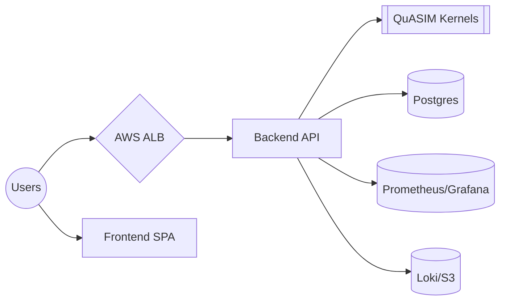

# Market Valuation Platform

Production-ready infrastructure and application stack for the QuASIM **Market Valuation** vertical. The solution targets AWS by default with guidance for Azure and GCP consumers.

## Architecture



The platform comprises:

* **Infrastructure**: Terraform to provision ECR, networking, and an EKS cluster.
* **Application Runtime**: Kubernetes Deployment exposing the QuASIM kernel service with autoscaling and ingress.
* **Frontend**: Lightweight dashboard visualising market valuation insights returned by the kernels.
* **CI/CD**: GitHub Actions pipelines for build, test, security scans, and deployment automation.
* **Security & Compliance**: TLS, network policies, IAM least privilege, and JWT-based service authentication.
* **Observability**: Prometheus metrics, Grafana dashboards, and structured logging.

## Quick Start

### 1. Local Development

POSIX:

```bash
python -m venv .venv
source .venv/bin/activate
pip install -r services/backend/requirements.txt
export FLASK_APP=services/backend/app.py
python services/backend/app.py
```

Windows (PowerShell):

```powershell
python -m venv .venv
.venv\Scripts\Activate.ps1
pip install -r services/backend/requirements.txt
$env:FLASK_APP = "services/backend/app.py"
python services/backend/app.py
```

Visit `http://localhost:8000/health` to confirm the service is running.

### 2. Run Tests

POSIX: `python -m pytest services/backend/tests -q`

Windows: `python -m pytest services\backend\tests -q`

### 3. Build Containers

POSIX: `docker build -t quasim/market_valuation:backend services/backend`

Windows: `docker build -t quasim/market_valuation:backend services\backend`

### 4. Deploy (Kubernetes)

```bash
kubectl apply -f infra/k8s/namespace.yaml
kubectl apply -f infra/k8s/deployment.yaml
kubectl apply -f infra/k8s/service.yaml
kubectl apply -f infra/k8s/ingress.yaml
kubectl apply -f infra/k8s/hpa.yaml
```

### 5. Terraform (Infrastructure)

```bash
cd infra/terraform
terraform init
terraform plan -var-file=env/prod.tfvars
```

## Troubleshooting

* Ensure Docker Desktop is configured to use WSL2 on Windows.
* Set `JAX_PLATFORM_NAME=cpu` to avoid GPU dependency locally.
* Missing certificates? Deploy `security/cluster-issuer.yaml` via `kubectl`.
* Prometheus scrape failures typically indicate network policy misconfiguration—review `security/network-policy.yaml`.

## Implementation Notes

* **Tech Stack**: Python 3.10 + Flask, Gunicorn with Uvicorn workers, deterministic JAX kernel invocations.
* **IaC**: Terraform provisions VPC, EKS, IAM, and ECR. Azure (AKS + ACR) and GCP (GKE + Artifact Registry) supported with analogous resources.
* **Security**: TLS termination via cert-manager, OAuth2 JWT validation, namespace isolation, IAM least privilege.
* **CI/CD**: GitHub Actions for build/test/scan/deploy with rollback via `kubectl rollout undo`.
* **Scalability**: Stateless backend for horizontal scaling; HPA monitors CPU and custom latency metrics; consider Redis for caching.
* **Data**: JSON schema documented in `services/backend/app.py`; optional PostgreSQL schema in `data/schema.sql`.

## How to Run Locally

POSIX:

```bash
make -C operators dev_up
```

Windows PowerShell:

```powershell
./operators/dev_up.ps1
```

## Validation Commands

* `python -m pytest services/backend/tests -q`
* `curl http://localhost:8000/kernel`
* `curl http://localhost:8000/metrics`
* `terraform validate infra/terraform`

