# QRATUM Lifecycle: 5-Stage Ephemeral Session

## Overview

QRATUM enforces a strict 5-stage lifecycle that ensures ephemeral existence, zero persistent state, and provable censorship resistance. Every stage is documented, audited, and bound by architectural invariants.

## Lifecycle Flowchart

```mermaid
flowchart TD
    Start([User Input TXOs]) --> Stage1
    
    Stage1[Stage 1: Quorum Convergence]
    Stage1 --> Q1{Consensus<br/>Reached?}
    Q1 -->|Yes| Stage2
    Q1 -->|No| Q2{Decay<br/>Threshold?}
    Q2 -->|Yes| Decay[Emit DecayJustification TXO]
    Decay --> Q3{Min<br/>Threshold?}
    Q3 -->|No| Q1
    Q3 -->|Yes| Stage2
    Q1 -->|Timeout| Fail1[Emit CensorshipEvent TXO]
    Fail1 --> End1([Session Aborted])
    
    Stage2[Stage 2: Ephemeral Materialization]
    Stage2 --> S1[Collect Shamir Shares]
    S1 --> S2[Reconstruct Biokey<br/>RAM-Only]
    S2 --> S3[Initialize Merkle Ledger<br/>RAM-Only]
    S3 --> S4[Initialize Canary State]
    S4 --> S5[Initialize Snapshot Manager]
    S5 --> S6[Initialize Proxy Manager]
    S6 --> S7[Initialize Watchdog Validators]
    S7 --> Stage3
    
    Stage3[Stage 3: Execution with Audit Hooks]
    Stage3 --> E1[Process Input TXOs]
    E1 --> E2[Emit Canary Probe]
    E2 --> E3{Canary<br/>Received?}
    E3 -->|No| Censor[Emit CensorshipEvent TXO]
    E3 -->|Yes| E4[Check Snapshot Due]
    E4 --> E5{Create<br/>Snapshot?}
    E5 -->|Yes| Snap[Create Volatile Snapshot<br/>Encrypted in RAM]
    E5 -->|No| E6
    Snap --> E6[Check Privileged Op]
    E6 --> E7{Proxy<br/>Required?}
    E7 -->|Yes| Proxy[Request Proxy Approval<br/>Bonded Stake]
    Proxy --> E8{Approved?}
    E8 -->|No| Fail2[Operation Rejected]
    E8 -->|Yes| E9
    E7 -->|No| E9[Execute Operation]
    E9 --> E10[Generate Compliance ZKP]
    E10 --> E11[Watchdog Validation]
    E11 --> E12[Update Merkle Ledger]
    E12 --> E13{More<br/>Operations?}
    E13 -->|Yes| E2
    E13 -->|No| E14[Compute Execution Hash]
    E14 --> Stage4
    
    Censor --> E4
    Fail2 --> E13
    
    Stage4[Stage 4: Outcome Commitment]
    Stage4 --> O1[Create Minimal Payload]
    O1 --> O2[Blind Payload<br/>SHA3-256 Commitment]
    O2 --> O3[Collect Quorum Signatures]
    O3 --> O4[Generate Outcome TXO<br/>ONLY Persistent Artifact]
    O4 --> Stage5
    
    Stage5[Stage 5: Total Self-Destruction]
    Stage5 --> D1[Zeroize Biokey]
    D1 --> D2[Zeroize Merkle Ledger]
    D2 --> D3[Zeroize Canary State]
    D3 --> D4[Zeroize Snapshots]
    D4 --> D5[Zeroize Proxy State]
    D5 --> D6[Zeroize Compliance Prover]
    D6 --> D7[Zeroize Watchdog State]
    D7 --> D8[Verify All Memory Scrubbed]
    D8 --> End2([Return Outcome TXOs<br/>Session Destroyed])
    
    style Stage1 fill:#e1f5ff
    style Stage2 fill:#fff4e1
    style Stage3 fill:#e8f5e9
    style Stage4 fill:#f3e5f5
    style Stage5 fill:#ffebee
    style End1 fill:#ff0000,color:#fff
    style End2 fill:#00ff00,color:#000
```



## Stage Details

### Stage 1: Quorum Convergence

**Objective**: Multi-party participants reach consensus before session proceeds.

**Inputs**:

- Quorum configuration (initial threshold, decay parameters)
- Quorum member list with reputation stakes

**Outputs**:

- Consensus decision (votes collected)
- OR DecayJustification TXOs (if threshold adjusted)
- OR CensorshipEvent TXO (if convergence fails)

**Key Operations**:

1. Initialize quorum state with initial threshold (e.g., 67%)
2. Collect votes from active quorum members
3. Check consensus (votes >= threshold × active members)
4. If no consensus and decay interval elapsed:
   - Decrease threshold by decay step (e.g., 5%)
   - Emit DecayJustification TXO with rationale
   - Continue collection with new threshold
5. If minimum threshold reached without consensus or timeout:
   - Emit CensorshipEvent TXO
   - Abort session

**Anti-Censorship**:

- Every threshold decay emits auditable TXO
- External observers verify decay legitimacy
- Timeout triggers investigation

**Security Invariants**:

- Byzantine tolerance (f faulty nodes in 3f+1 quorum)
- Progressive decay prevents permanent deadlock
- Audit trail ensures accountability

---

### Stage 2: Ephemeral Materialization

**Objective**: Reconstruct ephemeral keys and initialize RAM-only state.

**Inputs**:

- Quorum convergence result (including Shamir shares)
- Session configuration

**Outputs**:

- Ephemeral biokey (512-bit, RAM-only)
- Initialized Merkle ledger (RAM-only)
- Canary state, snapshot manager, proxy manager
- Watchdog validators

**Key Operations**:

1. Collect M-of-N Shamir shares from quorum members
2. Reconstruct biokey using Lagrange interpolation
3. Initialize in-memory Merkle ledger (zeroized on drop)
4. Initialize canary state with session ID
5. Create snapshot manager (bounded history)
6. Setup proxy manager with registered participants
7. Rotate and activate watchdog validators

**Security Invariants**:

- Biokey never touches disk (RAM-only)
- Shamir threshold enforced (M-of-N)
- All state auto-zeroized on drop
- No external persistence

**Biokey Properties**:

- 512-bit key material (SHA3-512 derivation)
- Epoch counter for rotation tracking
- Auto-wipe on drop via Zeroize trait

---

### Stage 3: Execution with Audit Hooks

**Objective**: Execute computation with continuous monitoring and audit.

**Inputs**:

- Input TXOs from user
- Ephemeral session state

**Outputs**:

- Updated Merkle ledger with all operations
- Execution hash (ledger root)
- Audit TXOs (canary, compliance, proxy, censorship)

**Key Operations**:

#### Canary Emission Loop

1. Check if emission due (interval elapsed)
2. Compute state hash (Merkle root)
3. Generate canary probe (sequence, timestamp, state hash)
4. Chain to previous canary (integrity)
5. Emit to external observers
6. If canary not acknowledged → Emit CensorshipEvent TXO

#### Volatile Snapshot Path

1. Check if snapshot due (interval elapsed)
2. Serialize current execution state
3. Encrypt with ephemeral biokey
4. Store in bounded in-memory buffer
5. If fault occurs → Restore from latest snapshot

#### Proxy Approval Branch

1. Detect privileged operation request
2. Submit approval request with justification
3. Proxies bond reputation stake
4. Collect M-of-N proxy signatures
5. If approved → Execute operation
6. If rejected → Abort operation, emit audit TXO
7. On completion → Release bonded stakes

#### Compliance ZKP Generation

1. Identify applicable regulation (GDPR, HIPAA, etc.)
2. Prepare private inputs (sensitive data)
3. Prepare public inputs (claims)
4. Generate ZKP proof (Halo2 or Risc0)
5. Attach proof to operation TXO
6. External verifiers validate proof

#### Watchdog Validation

1. Check if epoch rotation due
2. Rotate validators (nomadic pattern)
3. Active validators audit execution
4. Validators emit attestations
5. Detect and report anomalies

#### Rollback Capability

1. Create ledger checkpoint
2. Execute operation
3. If error → Rollback to checkpoint
4. Emit audit TXO documenting rollback
5. Rollback ONLY within current session

**Security Invariants**:

- All operations logged to ledger
- Canaries prove liveness
- Proxies stake reputation capital
- Compliance proven without exposure
- Watchdogs rotate to prevent capture

---

### Stage 4: Outcome Commitment

**Objective**: Create minimal, blinded, signed Outcome TXOs (ONLY persistent artifacts).

**Inputs**:

- Execution hash (Merkle root)
- Computation results

**Outputs**:

- Outcome TXOs (minimal, blinded, signed)

**Key Operations**:

1. Create minimal payload (computation result)
2. Blind payload with SHA3-256 commitment
3. Set quorum reveal threshold (e.g., 67%)
4. Collect quorum member signatures over:
   - Payload commitment
   - Execution hash
   - Timestamp
5. Create OutcomeTxo with:
   - Blinded payload
   - Execution hash
   - Quorum signatures
6. Return OutcomeTxo(s) as ONLY persistent artifact

**Security Invariants**:

- Minimal payload reduces attack surface
- Blinded commitment prevents inspection
- Quorum signatures provide attestation
- Reveal requires future quorum consensus
- No intermediate state persists

**Outcome TXO Properties**:

- Content-addressed ID (SHA3-256)
- CBOR primary encoding
- Predecessor TXO links (provenance)
- Optional compliance ZKP attached

---

### Stage 5: Total Self-Destruction

**Objective**: Explicitly zeroize ALL ephemeral state. Nothing persists except Outcome TXOs.

**Inputs**:

- Ephemeral session state (to be destroyed)

**Outputs**:

- None (all state destroyed)

**Key Operations**:

1. Zeroize biokey (512-bit key material)
2. Zeroize Merkle ledger (all TXOs and nodes)
3. Zeroize canary state (history and sequence)
4. Zeroize volatile snapshots (encrypted data)
5. Zeroize proxy manager (bonded stakes and approvals)
6. Zeroize compliance prover (cached proofs)
7. Zeroize watchdog state (validators and attestations)
8. Verify memory scrubbing complete
9. Return control with Outcome TXOs only

**Security Invariants**:

- Explicit zeroization (not just drop)
- Multi-pass memory scrubbing
- Prevents memory forensics
- Enforces ephemeral architecture
- Anti-holographic (no state residue)

**Zeroization Strategy**:

- All sensitive types derive `Zeroize` and `ZeroizeOnDrop`
- Explicit `zeroize()` call before drop
- Overwrite memory with zeros
- Multiple passes for sensitive data
- Compiler barriers prevent optimization

---

## Architectural Guarantees

### Ephemeral Existence

- System exists ONLY during Stage 2-5
- No state between sessions
- Complete lifecycle < 1 hour typical

### Zero Persistent State

- Only Outcome TXOs survive Stage 5
- All other data zeroized
- No logs, no disk writes, no residuals

### Provable Censorship Resistance

- Every suppression emits signed TXO
- External observers verify liveness
- Canary gaps trigger investigation
- Decay justifications auditable

### Privacy-Preserving Compliance

- ZKP proves regulations met
- No sensitive data exposure
- Verifiable by regulators
- Blinded payloads prevent inspection

### Session-Bound Reversibility

- Rollback within session only
- No inter-session rollback
- Audit trail for all rollbacks
- Checkpoints zeroized on session end

### Forward Compatibility

- Post-quantum migration hooks
- Circuit upgradeability
- Extensible TXO types
- Federated mesh support (future)

---

## Anti-Censorship Mechanisms

### 1. Canary Probes

- Regular emissions prove liveness
- External observers verify stream
- Missing canaries trigger alerts
- Sequence gaps detected immediately

### 2. Decay Justification TXOs

- Every threshold change auditable
- Prevents covert manipulation
- External verification of legitimacy
- Accountability for decay decisions

### 3. Censorship Event TXOs

- Suppression/delay automatically documented
- Signed by observers
- Provable evidence of censorship
- Triggers investigation protocols

### 4. Watchdog Validators

- Nomadic rotation prevents capture
- Independent audit of execution
- Byzantine fault tolerance
- Attestations provide assurance

---

## Fault Recovery

### Mid-Session Faults

1. Detect execution failure
2. Restore from latest volatile snapshot
3. Decrypt with ephemeral biokey
4. Verify snapshot integrity (hash check)
5. Resume execution from checkpoint
6. Log recovery event to ledger

### Session-Level Faults

- No recovery (session aborted)
- Emit fault TXO with diagnostic
- Quorum decides on retry
- New session starts from Stage 1

---

## External Verification

### Canary Stream Verification

```
1. Observer receives canary TXO
2. Verify signature
3. Check sequence continuity
4. Verify timing consistency
5. Validate hash chain
6. Alert if anomaly detected
```

### Outcome TXO Verification

```
1. Verify quorum signatures
2. Check execution hash
3. Validate compliance ZKP (if present)
4. Verify predecessor links
5. Store for future reveal (if needed)
```

### Compliance ZKP Verification

```
1. Extract public inputs
2. Verify proof (Halo2/Risc0)
3. Check circuit soundness
4. Validate attestation signature
5. Record compliance status
```

---

## Implementation Notes

### Critical Paths

- **Biokey reconstruction**: Must complete before any operation
- **Canary emission**: Must not be delayed (triggers censorship detection)
- **Zeroization**: Must be explicit and verifiable

### Performance Considerations

- Merkle tree updates: O(log n) per operation
- Shamir reconstruction: O(M²) for M-of-N shares
- ZKP generation: Varies by circuit (1-60s typical)
- Snapshot encryption: O(n) for state size n

### Memory Bounds

- Ledger TXOs: Bounded by session duration
- Canary history: Last 100 probes
- Snapshots: Last 5 checkpoints
- Proxy approvals: Active requests only

---

## Compliance Mapping

| Regulation | Circuit | Proof Type | Verification |
|------------|---------|------------|--------------|
| GDPR Art.17 | Right to Erasure | Halo2 | Zeroization proof |
| HIPAA 164.308 | Admin Safeguards | Risc0 | Access control proof |
| SOC 2 Type II | Trust Services | Halo2 | Audit trail proof |
| ISO 27001 | Info Security | Risc0 | Security control proof |

---

## Future Enhancements

### Planned Amendments

- **Federated Ephemeral Mesh**: Multi-node QRATUM instances
- **Synthetic Rehearsal Mode**: Test mode with deterministic replay
- **Post-Quantum Migration**: Lattice-based cryptography
- **Hardware TEE Integration**: Intel SGX, AMD SEV, ARM TrustZone

### Research Directions

- **Quantum-Resistant ZKP**: Beyond Halo2/Risc0
- **Distributed Biokey**: Multi-party computation
- **Probabilistic Censorship Detection**: ML-based anomaly detection
- **Formal Verification**: Coq/Lean proofs of lifecycle properties

---

## Glossary

- **TXO**: Transaction Object (fundamental unit)
- **Biokey**: Ephemeral cryptographic key
- **Quorum**: Multi-party consensus group
- **Canary**: Liveness proof probe
- **Decay**: Threshold reduction mechanism
- **ZKP**: Zero-Knowledge Proof
- **Merkle Ledger**: Tree-structured audit log
- **Outcome TXO**: Persistent result artifact
- **Zeroization**: Secure memory scrubbing

---

**Document Version**: 1.0  
**Last Updated**: 2024-12-24  
**Status**: Implementation Complete
